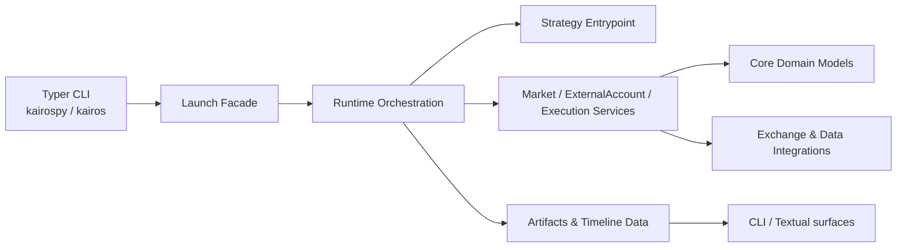

# KairosPy


KairosPy 是一个面向量化交易实验的 Python 工具包，提供策略运行、回测、纸交易、账户/订单/行情投影、交易所集成和时间线数据能力。

交易所接入说明：

- [Binance 产品](docs/binance-products.md)
- [OKX 与 Hyperliquid 的 CCXT 接入](docs/ccxt-crypto-integrations.md)

## ✨ 功能亮点

- 🚀 **策略运行时**：通过 `kairospy` / `kairos` CLI 启动、停止、查看和诊断 launch。
- 📈 **回测与纸交易**：内置 backtest、paper、live 等运行模式的配置入口。
- 🧾 **账户与订单视图**：围绕 account、order、execution、risk、trace 等领域组织状态投影。
- 🔌 **交易所与数据集成**：包含 Binance、CCXT、Massive 等 integration scaffold。
- 🖥️ **终端界面**：通过 CLI 和 Textual 组织运行时状态与时间线数据。
- 🧪 **测试覆盖**：使用 pytest 覆盖 CLI、运行时、市场、账户、执行和参考数据模块。

## 🧭 架构速览



## 📦 安装

项目使用 Python 3.11+。推荐用 `uv` 管理依赖：

```bash
uv sync --group dev
```

按需安装可选能力：

```bash
uv sync --extra crypto --extra query --group dev
```

如果你更习惯 pip，也可以在虚拟环境中安装本地包：

```bash
python -m pip install -e ".[crypto,query]"
python -m pip install pytest
```

## ⚡ 快速开始

查看 CLI 帮助：

```bash
uv run kairospy --help
uv run kairos --help
```

初始化一个 Kairos 项目：

```bash
uv run kairos init my-project
```

这会创建 `.kairos/kairos.toml` 以及项目运行所需的本地目录。完整写法
`kairos project init my-project` 仍然可用。

校验一个回测配置：

```bash
uv run kairospy launch diagnose validate examples/configs/btc_sma_backtest.toml
```

解释 launch 配置：

```bash
uv run kairospy launch diagnose explain examples/configs/btc_sma_backtest.toml
```

启动回测：

```bash
uv run kairospy launch start examples/configs/btc_sma_backtest.toml
```

查看运行状态和日志：

```bash
uv run kairospy launch status
uv run kairospy launch logs --limit 100
```

启动内置 system runtime 管理账户和调试下单：

```bash
uv run kairospy system up
uv run kairospy system status
uv run kairospy system account trade-status
uv run kairospy system account trade-acquire main
uv run kairospy system account trade-release main
```

导出时间线数据：

```bash
uv run kairospy launch timeline export --latest binance-spot-btc-sma-backtest
```

进入交互式命令 shell：

```bash
uv run kairospy shell
```

列表浏览

列表命令保持适合脚本的无状态输出；需要人工翻页、搜索或查看单行详情时，使用统一的 `browse` 子命令：

```bash
uv run kairospy catalog assets browse --type crypto
uv run kairospy catalog markets browse --venue binance --active-only
uv run kairospy account browse
uv run kairospy launch targets browse
uv run kairospy order browse --account main
```

浏览器支持 `n`/`p` 翻页、`/text` 跨字段搜索、`query JMESPATH` 通用查询、`filter key=value` 条件过滤、`sort field` 或 `sort -field` 排序、`size N` 修改页大小、`open N` 查看当前页的行、`json` 导出当前查询结果、`clear` 清除搜索条件，以及 `q` 退出。也可以通过 `browse --query 'JMESPATH'` 预置查询。JMESPath 表达式必须返回对象数组，以便继续分页和显示结果。它也可以从 `kairospy shell` 中执行对应的 `browse` 命令。

在真实 TTY 中，`browse` 会进入 Textual 全屏模式：`/` 聚焦搜索、`f` 聚焦过滤、`s` 聚焦排序、`g` 聚焦页码、`n`/`p` 翻页、方向键选择行、回车打开详情、Esc 取消详情或编辑、`q` 退出。通过管道或测试环境运行时自动使用行式模式。`e` 和 `Ctrl+S` 已支持通用编辑流程，但只有注册了资源 `save` 回调的资源可写；当前资产、市场、账户和订单浏览均为只读。

这套能力位于 `application.browsing` 和 `surface.interactive.browse`：application 层负责查询、过滤、排序和分页，surface 层负责行式浏览与 Textual 全屏展示。领域命令只负责提供 rows 与领域过滤条件，因此后续列表资源可以复用同一套交互行为，不需要各自实现分页循环。

Shell 层级约定：

- CLI 路径按 `product resource action` 组织，例如 `catalog assets browse`、`system attach`、`launch targets list`。
- `product` 和 `resource` 可以成为 `kairospy shell` 的上下文；`list`、`browse`、`show`、`attach`、`start`、`stop`、`logs` 等 action 只执行命令，不成为新的 shell 上下文。
- `system` 是内置 system runtime 的顶层产品入口。需要连接正在运行的 system runtime 时使用 `system attach`。
- system daemon 的健康心跳写入 launch `state.json`；attach 会把状态心跳以 `[system/heartbeat]` 展示出来。普通脚本输出仍保持无状态、可解析。

`kairospy tui` 目前是实验入口，项目默认推荐使用普通 CLI 和 `kairospy shell`。

## 账户、Scope 与交易锁

账户状态所有权、刷新与查询契约见 [`docs/account-read-design.md`](docs/account-read-design.md)。

领域模型把交易所账户身份和账户内 segment 分开表达：

- `ExternalAccountIdentity` 表示一个真实账户身份，例如 `binance:main`。
- `AccountSegment` 表示该账户内的一个具体资金/交易分区，例如 `binance:remote:spot` 或 `binance:remote:usd_m_futures`。

通过 API credential 连接交易所后，系统会发现远端账户并将本地 binding 写入 `.kairos/accounts/<binding>.toml`。应用不会创建 Binance 账户：

```toml
[accounts.main]
ref = "main"
trade = true

[accounts.shadow]
ref = "main"
trade = false
```

账户可以被多个 launch 重复引用，但同一账户同一时间只有一个 launch 可以持有交易锁并下单。`trade = false` 表示只读引用：可以读取账户数据，但不会申请交易锁，也不会被标记为可下单。launch account 默认展开已发现的全部 segment；如果某个 launch 只想管理少数 segment，可以额外写 `segments = ["spot"]` 作为过滤。

Binance 产品按账户 book 分开管理：`spot`、`usd_m_futures`、`options` 和 `earn`。USDⓈ-M Futures 的行情、账户和标准订单优先使用可注入的 CCXT 连接；BTC 期权和 Simple Earn 使用 Binance 原生 API，因为它们分别包含期权合约/结算语义和理财产品申赎语义。示例见 [`examples/configs/binance_products_live.toml`](examples/configs/binance_products_live.toml)。

内置 system runtime 的 launch id 固定为 `kairos-system`。它启动后会加载 workspace 中的全部账户，并尝试占有当前未被锁定的可交易账户；被其他 launch 锁定的账户仍可读取状态，但 system 下单前会重新检查账户锁，只有锁归当前 system instance 时才允许交易。

live 账户通过 credential 连接和发现：

```bash
uv run kairospy account credential create binance_read --broker binance --api-key ... --api-secret ...
uv run kairospy account credential create binance_trade --broker binance --api-key ... --api-secret ...
uv run kairospy account connect --broker binance --environment live --credential binance_read --alias main
uv run kairospy account connect --broker binance --environment live --credential binance_trade --credential-role trade --alias main
```

```toml
[account]
id = "main"
broker = "binance"
environment = "live"

[credentials.readonly]
ref = "binance_read"

[credentials.trade]
ref = "binance_trade"
```

如果需要交易权限，应将 trade credential 作为同一远端账户的另一个访问凭据绑定；credential 不是另一个账户。连接时系统会校验私有读取权限，并记录远端身份和已发现 segment。

API key 不通过环境变量注入。`account credential create` 只保存凭据；`account connect` 才建立本地远端账户 binding。`--alias` 只是本地显示名，不是交易所账户 ID。旧的 `provider`、`venue`、`market`、`currency` 字段仍可读取；新生成的 binding 文件默认只写发现所需字段。

查询交易所实际返回的账号类型、权限和可用分区：

```bash
uv run kairospy account inspect main
```

`configured_segments` 是本地配置，`discovered_segments` 是本次凭据探测得到的分区；查询时应以发现结果为准。

创建 paper/backtest 模拟账户时，初始状态使用多资产余额，不使用单一 `cash`：

```bash
uv run kairospy account simulate paper_demo \
  --balance USDT=10000 \
  --balance USDC=5000 \
  --balance BTC=0.25
```

真实交易所账户由 API key 绑定，`account connect` 不创建账户，也不接受初始余额。保证金账户的多币种抵押物由交易所账户快照提供。

直接查询账户余额使用单数 `balance`：

```bash
uv run kairospy account query balance main
uv run kairospy account query balance main --segment spot
uv run kairospy account query balance main --segment spot --segment usd_m_futures
uv run kairospy account query balance main --include-zero
uv run kairospy account query balance main --page 2 --page-size 50
```

`account query balance` 默认查询已绑定的全部 segment，并过滤 free/used/total 全为 0 的资产；`--segment` 可重复传入以限制查询范围。每个 segment 独立查询，某个 segment 因权限或账户类型失败时不会阻断其它 segment，失败项会显示在 `Balance Errors` 中。分页结果会在 text 和 JSON 输出中带上 `page` metadata。

直接查询仓位也不依赖已启动的 System：

```bash
uv run kairospy account query positions main --segment usd_m_futures
uv run kairospy account query positions main --segment coin_m_futures --symbol BTC/USD:BTC
```

`account query` 下的命令都直接面向已绑定的 ExternalAccount。需要读取已启动 Account Actor 的运行时投影时，使用显式的 System 命令：

```bash
uv run kairospy system account current main
uv run kairospy system account balances main
uv run kairospy system account positions main
```

这三条命令依赖运行中的 System，用于观察运行时状态，不用于验证交易所 API 账号连接。

## 🧪 示例配置

`examples/` 中包含三类与当前架构对应的示例：

| 文件 | 用途 |
| --- | --- |
| `examples/market/binance_spot_trade_stream.py` | Integration connection 直接监听 Binance Spot trade |
| `examples/market/binance_spot_runtime.py` | Market runtime 订阅并消费 Binance Spot trade |
| `examples/strategies/btc_sma.py` | 最小 SMA strategy |
| `examples/configs/btc_sma_backtest.toml` | 使用 composition/launch 运行 SMA 回测 |

更多运行说明见 [`examples/README.md`](examples/README.md)。

## 🗂️ 项目结构

```text
kairospy/
  application/        # CLI facade、launch、runtime orchestration、strategy entrypoint
  core/               # account、execution、intent、market、order、reference 等领域模型
  infrastructure/     # integrations 与 persistence adapters（market data、reference、runtime state、artifacts）
  surface/            # CLI、interactive shell、Textual 与渲染层
examples/
  configs/            # launch 配置示例
  strategies/         # 策略示例
tests/                # pytest 测试
```

## 🛠️ 开发命令

运行测试：

```bash
uv run pytest
```

运行单个测试文件：

```bash
uv run pytest tests/test_backtest_config_launcher.py
```

查看项目入口：

```bash
uv run kairospy shell
```

## 📌 说明

这是一个仍在演进中的交易策略运行工具包。真实交易前，请务必先使用 backtest / paper 模式验证策略、账户配置、数据源和风控逻辑。
