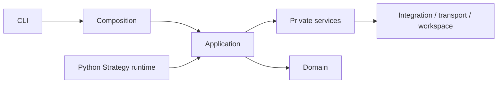

# KairosPy


KairosPy 是一个面向量化交易实验的策略运行工具包，提供回测、纸交易、账户与订单状态、行情、交易所集成和运行观测能力。

## 核心能力

- 通过 `kairos` / `kairospy` CLI 管理项目、Launch 和运行诊断；
- 使用同一套配置运行 backtest、paper 和 live 模式；
- 由 Account、Execution、Market、Reference 和 Risk 模块分别拥有业务状态；
- 集成 Binance、OKX、Hyperliquid、Massive 等 Provider；
- 通过逻辑 route 异步投递策略通知，Backtest 默认只记录本地 artifact；
- 使用 Rust 业务进程和 Python Strategy runtime 组成运行实例。

## 安装

项目要求 Python 3.11+，推荐使用 `uv`：

```bash
uv sync --group dev
```

需要可选能力时显式安装对应 extra：

```bash
uv sync --extra crypto --extra query --group dev
```

从源码构建 wheel 需要本机安装 Cargo/Rust toolchain。

## 快速开始

创建一个不依赖交易所凭据和网络连接的回测项目：

```bash
uv run kairos project init my-project --id my-project --non-interactive --template backtest
cd my-project
uv run kairos launch diagnose validate demo-backtest
uv run kairos launch start demo-backtest
uv run kairos launch wait demo-backtest
```

打开项目观测台：

```bash
uv run kairos observe --workspace my-project
```

详细的 Launch、Data、Research、账户、行情和日志操作见
[`docs/guides/operations.md`](docs/guides/operations.md)。

## 架构速览



仓库架构、所有权和依赖约束以 [`AGENTS.md`](AGENTS.md) 为准；机器可读跨进程合同以
[`schemas/`](schemas/README.md) 为准。

## 文档

- [文档导航](docs/README.md)
- [详细操作指南](docs/guides/operations.md)
- [策略通知](docs/guides/strategy-notifications.md)
- [当前架构](docs/architecture/README.md)
- [Integration 能力与来源证据](docs/integrations/README.md)
- [架构决策](docs/decisions/README.md)

## 项目结构

```text
kairospy/              Python application、strategy、infrastructure 和 CLI
crates/modules/        Account、Execution、Market、Reference、Risk 业务模块
crates/platform/       Integration、Network、Protocol、Transport、Workspace
crates/primitives/     多模块真正共享且无基础设施依赖的值对象
schemas/               FlatBuffers 和 OpenAPI 跨进程合同
docs/                  Guide、当前架构、Integration 证据和 Decision
tests/                 Python 测试
```

## 开发验证

```bash
cargo test --workspace
uv run pytest -q
make rust-fmt-check
git diff --check
python3 scripts/check/check_crate_layout.py
python3 scripts/check/check_workspace_dependencies.py
python3 scripts/check/check_documentation.py
```

修改 OpenAPI 或 FlatBuffers schema 时额外运行：

```bash
make docs-check
```

真实交易前应先使用 backtest 和 paper 模式验证策略、账户配置、数据源与风控逻辑。
