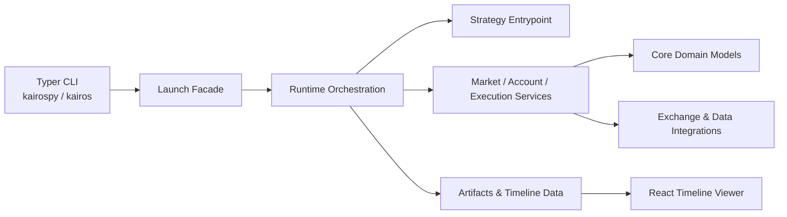

# KairosPy


KairosPy 是一个面向量化交易实验的 Python 工具包，提供策略运行、回测、纸交易、账户/订单/行情投影、交易所集成和时间线可视化能力。

## ✨ 功能亮点

- 🚀 **策略运行时**：通过 `kairospy` / `kairos` CLI 启动、停止、查看和诊断 launch。
- 📈 **回测与纸交易**：内置 backtest、paper、live 等运行模式的配置入口。
- 🧾 **账户与订单视图**：围绕 account、order、execution、risk、trace 等领域组织状态投影。
- 🔌 **交易所与数据集成**：包含 Binance、CCXT、Massive 等 integration scaffold。
- 🖥️ **时间线查看器**：React + lightweight-charts 构建的运行时间线 UI。
- 🧪 **测试覆盖**：使用 pytest 覆盖 CLI、运行时、市场、账户、执行和参考数据模块。

## 🧭 架构速览



## 📦 安装

项目使用 Python 3.11+。推荐用 `uv` 管理依赖：

```bash
uv sync --group dev
```

按需安装可选能力：

```bash
uv sync --extra crypto --extra query --extra tui --group dev
```

如果你更习惯 pip，也可以在虚拟环境中安装本地包：

```bash
python -m pip install -e ".[crypto,query,tui]"
python -m pip install pytest
```

## ⚡ 快速开始

查看 CLI 帮助：

```bash
uv run kairospy --help
uv run kairos --help
```

校验一个回测配置：

```bash
uv run kairospy launch diagnose validate examples/configs/binance_spot_btc_sma_backtest.toml
```

解释 launch 配置：

```bash
uv run kairospy launch diagnose explain examples/configs/binance_spot_btc_sma_backtest.toml
```

启动回测：

```bash
uv run kairospy launch run start examples/configs/binance_spot_btc_sma_backtest.toml
```

查看运行状态和日志：

```bash
uv run kairospy launch run status
uv run kairospy launch observe logs --limit 100
```

启动内置 system runtime 管理账户和调试下单：

```bash
uv run kairospy launch system up
uv run kairospy system account trade-status
uv run kairospy system account trade-acquire main
uv run kairospy system account trade-release main
```

打开时间线查看器：

```bash
uv run kairospy timeline open --latest binance-spot-btc-sma-backtest
```

## 账户引用与交易锁

通过 `kairospy account create` 创建的账户会写入 `.kairos/accounts/<account>.toml`。paper/live launch 可以在配置中引用这些账户：

```toml
[accounts.main]
ref = "main"
books = ["spot"]
trade = true

[accounts.shadow]
ref = "main"
books = ["spot"]
trade = false
```

账户可以被多个 launch 重复引用，但同一账户同一时间只有一个 launch 可以持有交易锁并下单。`trade = false` 表示只读引用：可以读取账户数据，但不会申请交易锁，也不会被标记为可下单。

内置 system runtime 的 launch id 固定为 `kairos-system`。它启动后会加载 workspace 中的全部账户，并尝试占有当前未被锁定的可交易账户；被其他 launch 锁定的账户仍可读取状态，但 system 下单前会重新检查账户锁，只有锁归当前 system instance 时才允许交易。

live 账户可以配置多个具名 credential：

```bash
uv run kairospy account create main --provider binance --environment live --credential-role readonly --api-key ... --api-secret ...
uv run kairospy credential create binance_read --provider binance --api-key ... --api-secret ...
uv run kairospy credential create binance_trade --provider binance --api-key ... --api-secret ...
uv run kairospy account credential-add main readonly --ref binance_read
uv run kairospy account credential-add main trade --ref binance_trade
```

```toml
[credentials.readonly]
ref = "binance_read"

[credentials.trade]
ref = "binance_trade"
```

如果账户只有 `readonly` key，live launch 会使用它读取账户数据，但不会把该账户标记为可交易，也不会支持下单。添加 key 时，`account credential-add` 默认会校验 role 和账户身份；确实只想先写入配置时可以使用 `--no-check`。

API key 不通过环境变量注入。`credential create` 会写入 `.kairos/credentials/<credential_id>.toml`，账户配置只保存 credential id 引用。`account create` 直接传 `--api-key`/`--api-secret` 时也会创建同名 credential 文件，并在账户里写入 `[credentials.readonly]` 或 `[credentials.trade]`；可以用 `--credential <credential_id>` 指定 credential id。

## 🧪 示例配置

`examples/configs/` 中包含几类可参考配置：

| 文件 | 用途 |
| --- | --- |
| `binance_spot_btc_sma_backtest.toml` | BTC/USDT SMA 现货策略回测 |
| `binance_btc_funding_arbitrage_backtest.toml` | BTC 资金费率套利回测 |
| `binance_hot_funding_arbitrage_backtest.toml` | 多币种资金费率套利回测 |
| `news_factor_backtest.toml` | 新闻因子策略回测 |
| `paper-printer.toml` | Binance spot 纸交易配置 |

## 🖼️ 时间线前端

前端查看器位于 `view/`，使用 React 19、Vite、Tailwind CSS 和 `lightweight-charts`：

```bash
cd view
npm install
npm run dev
```

构建静态资源：

```bash
cd view
npm run build
```

构建后的资源会用于 `kairospy timeline open` 提供的本地查看体验。

## 🗂️ 项目结构

```text
kairospy/
  application/        # CLI facade、launch、runtime orchestration、strategy entrypoint
  core/               # account、execution、intent、market、order、reference 等领域模型
  infrastructure/     # artifacts、data store、exchange/data provider integrations
  surface/            # CLI、interactive shell、timeline server 与渲染层
examples/
  configs/            # launch 配置示例
  strategies/         # 策略示例
tests/                # pytest 测试
view/                 # React/Vite 时间线查看器
```

## 🛠️ 开发命令

运行测试：

```bash
uv run pytest
```

运行单个测试文件：

```bash
uv run pytest tests/test_backtest_config_launcher.py
```

查看项目入口：

```bash
uv run kairospy shell
```

## 📌 说明

这是一个仍在演进中的交易策略运行工具包。真实交易前，请务必先使用 backtest / paper 模式验证策略、账户配置、数据源和风控逻辑。
