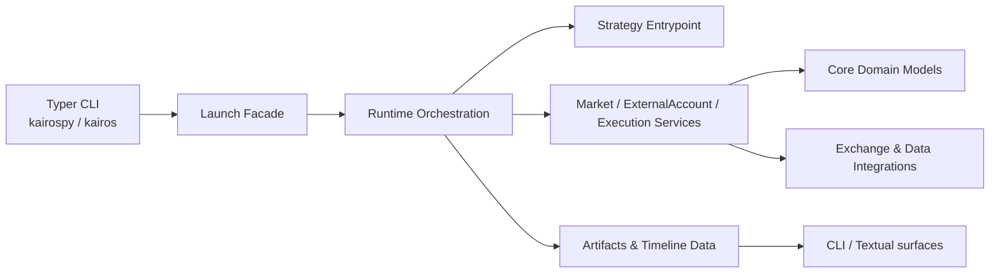

# KairosPy


KairosPy 是一个面向量化交易实验的 Python 工具包，提供策略运行、回测、纸交易、账户/订单/行情投影、交易所集成和时间线数据能力。

## ✨ 功能亮点

- 🚀 **策略运行时**：通过 `kairospy` / `kairos` CLI 启动、停止、查看和诊断 launch。
- 📈 **回测与纸交易**：内置 backtest、paper、live 等运行模式的配置入口。
- 🧾 **账户与订单视图**：围绕 account、order、execution、risk、trace 等领域组织状态投影。
- 🔌 **交易所与数据集成**：包含 Binance、OKX、Hyperliquid、Massive 等 integration scaffold。
- 🖥️ **终端界面**：通过 CLI 和 Textual 组织运行时状态与时间线数据。
- 🧪 **测试覆盖**：使用 pytest 覆盖 CLI、运行时、市场、账户、执行和参考数据模块。

## 🧭 架构速览



## 📦 安装

项目使用 Python 3.11+。推荐用 `uv` 管理依赖：

```bash
uv sync --group dev
```

按需安装可选能力：

```bash
uv sync --extra crypto --extra query --group dev
```

如果你更习惯 pip，也可以安装 wheel。wheel 会携带匹配平台的 Rust
server/cli 业务组件；从源码包安装时需要本机具备 Cargo/Rust toolchain：

```bash
python -m pip install ".[crypto,query]"
python -m pip install pytest
```

## ⚡ 快速开始

创建一个包含离线行情、模拟账户、示例策略和 launch 配置的回测项目：

```bash
uv run kairos project init my-project --id my-project --non-interactive --template backtest
cd my-project
uv run kairos launch diagnose validate demo-backtest
uv run kairos launch start demo-backtest
uv run kairos launch wait demo-backtest
```

这条路径不需要交易所凭据或网络连接。生成的 `KAIROS_QUICKSTART.md` 会说明示例资产和下一步操作。

打开项目观测台（需要一个已经初始化的 workspace）：

```bash
uv run kairos observe --workspace my-project
```

观测台不会自动启动业务进程；它读取 launch、System health、组件状态和可用的
Market snapshot，并根据最近状态提示下一条安全命令。无界面或脚本场景可以使用一次性 JSON 输出：

```bash
uv run kairos observe --workspace my-project --once
```

初始化一个 Kairos 项目（省略参数时会交互式询问目录和项目名）：

```bash
uv run kairos project init
```

脚本或 CI 使用非交互模式，并显式指定项目目录和 workspace ID：

```bash
uv run kairos project init my-project --id my-project --non-interactive
```

运行命令可以省略 `--workspace`。Python CLI 会按
`--workspace`、`KAIROS_WORKSPACE`、当前目录向上查找项目的 `.kairos/kairos.toml`（同时兼容
直接使用的 `workspace.toml`）；系统进程的
配置、状态、socket、日志和 launch 实例都限制在该 workspace 内。找不到 workspace
时，先运行 `kairos project init`；自动化环境使用带 `--non-interactive` 的完整命令。

不熟悉 TOML 时，可以用交互式向导创建或修改 launch 配置：

```bash
kairos launch init manual-trading
kairos launch edit manual-trading
```

向导会在保存前展示摘要，并复用 launch 配置校验；`live` 配置仍应在启动前通过
`launch diagnose validate` 和安全检查确认。脚本和 CI 继续使用直接编辑 TOML 与
`launch start` 的非交互路径。

项目代码保留在项目目录，Kairos 的 manifest、配置、状态、运行时文件和数据统一放在
`<project>/.kairos/` 下。

统一数据入口与 Python `Kairos.open(project).data` 进入同一个 Project-scoped
Data Application。`plan` 只审阅，不下载；`execute` 才会显式获取缺失数据：

```bash
uv run kairos data list --workspace my-project --output json
uv run kairos data plan requirements.json --workspace my-project --output json
uv run kairos data execute requirements.json --expected-plan-hash <plan-hash> --max-concurrency 2 --workspace my-project --output json
uv run kairos data execution <plan-hash> --workspace my-project --output json
uv run kairos data set list --workspace my-project --output json
```

`requirements.json` 是 `DataRequirement` 对象数组。命令返回逻辑 Dataset、
DatasetSetRef、Plan Hash 和执行 Journal，不暴露内部数据文件路径；Provider 凭据只允许
引用 `credential_id`。

Research 使用相同 Project 与固定版本的 `DatasetSetRef`。在查看 Holdout 结果前先锁定
研究计划；完成研究后，再用同一个计划和证据文件发布 Gate 2。CLI 与
`Kairos.open(project).research` 调用同一个 Research Application：

```bash
uv run kairos research plan lock research-plan.json --workspace my-project --output json
uv run kairos research plan show <research-plan-hash> --workspace my-project --output json
uv run kairos research gate publish research-plan.json research-evidence.json --workspace my-project --output json
uv run kairos research gate show <research-plan-hash> --workspace my-project --output json
```

`research-plan.json` 是 `ResearchSpec.as_dict()` 的持久化形式；
`research-evidence.json` 包含 `results`、`conclusion` 和 `limitations`。计划锁和 Gate
报告属于所选 Project 的 `.kairos/state/research`，研究源码仍位于独立仓库。

Research 是面向研究者的 API 门面，不是独立运行时。它只承担三类职责：便捷操作
Project Data、便捷启动 Canonical Launch，以及通过计划锁、参数预算、Holdout 纪律和
Gate 证据规定研究规范：

```python
kairos = Kairos.open("my-project")

# 与 kairos.data 完全相同的 Project 数据通路
snapshot = kairos.research.data.snapshot(read_plan)

# 与 kairos.launches 完全相同的 Launch Application
started = await kairos.research.launches.start("spy-put-spread-backtest")

# 参数研究可以有界并发启动多个独立 Canonical Backtest/Launch
batch = await kairos.research.backtests.run_many(cases, max_concurrency=2)
```

不存在 `research run`、Research Host 或 Research Process。研究者自己的 Python、
Notebook 和测试负责组织研究；所有正式回测仍进入现有 Launch + Config 通路。

launch 配置放在 workspace 的 `config/launches/<launch-id>.toml`，账户只通过
`ref` 引用 workspace 账户；运行时生成的 normalized config 和状态属于
`launches/<mode>/<launch-id>/instances/<instance-id>`。

```toml
[launch]
id = "btc-sma"
mode = "backtest"
strategy = "strategy:Factory"

[account]
ref = "simulated"

[backtest]
storage_format = "parquet"

[backtest.market]
start = "2024-01-01T00:00:00Z"
end = "2024-01-31T00:00:00Z"
```

校验一个回测配置：

```bash
uv run kairospy launch diagnose validate btc-sma --workspace my-project
```

解释 launch 配置：

```bash
uv run kairospy launch diagnose explain btc-sma --workspace my-project
```

启动回测：

```bash
uv run kairospy launch start btc-sma --workspace my-project
```

启动会自动生成本次运行的 UUID `instance_id` 并在结果中返回。日常查询、日志和停止
命令会自动解析当前运行中的 instance；只有需要操作历史运行时才传入 instance：

```bash
uv run kairospy launch status btc-sma --workspace my-project
uv run kairospy launch logs btc-sma --follow --workspace my-project
uv run kairospy launch stop btc-sma --workspace my-project
```

需要查询或停止某次历史运行时，再显式指定启动结果中的 `instance_id`：

```bash
uv run kairospy launch status btc-sma --instance <instance-id> --workspace my-project
uv run kairospy launch stop btc-sma --instance <instance-id> --workspace my-project
```

省略 `--config` 即可，系统会按 `config/launches/<launch-id>.toml` 自动发现
launch 配置。`--config` 仅用于显式指定其他配置文件。

查看运行状态和日志：

```bash
uv run kairospy launch status btc-sma --workspace my-project
uv run kairospy launch logs btc-sma --lines 100 --workspace my-project
uv run kairospy launch attach btc-sma --workspace my-project --lines 100
```

Launch 可以配置零个、一个或多个账户，并可关闭 Execution。账户只启动
`enabled = true` 的项；未配置 `[execution]` 时保持默认启动，显式设置
`enabled = false` 可只运行观察或研究 launch：

```toml
[launch]
id = "manual-trading"
mode = "paper"
strategy = "builtin:interactive"

[accounts.main]
ref = "main"
enabled = true

[accounts.secondary]
ref = "secondary"
enabled = true

[execution]
enabled = true
provider = "simulated"
product = "spot"
```

使用内置交互策略时，可以把 Python 代码直接发送到当前 Strategy instance：

```bash
uv run kairospy launch attach manual-trading --python --workspace my-project
```

代码在 Strategy process 内的 `on_command` 生命周期入口执行，可以访问
`strategy`、`context`、`accounts`、`execution` 和 `market`。账户查询使用异步
方法，例如 `await accounts.current("main")`；普通用户策略也可以
自行实现 `on_command`，定义自己的 command kind 和处理逻辑。

Strategy 的行情订阅返回 owner-scoped `SubscriptionLease`，实例停止或失败时由运行时自动
批量释放。需要独立于策略长期采集的行情，应在 Workspace manifest 中配置
`[market.collections.<name>]`；它由 Workspace 而不是 Strategy 拥有，数据持续追加到
`data/market/collections/<name>/events.jsonl`。完整的 Context 能力与配置示例见

`launch status` 返回 launch 整体状态，同时包含策略状态、依赖组件状态以及异常组件；
mode 由 launch 配置和 instance identity 决定，查询、日志和停止命令不需要重复传入
`--mode`；`system list` 和 `system logs` 适合进一步排查单个底层进程。

Rust 业务 server 的运行日志统一输出为 JSONL，并由 system supervisor 写入
`logs/processes/<component>.log`（实例模式下位于对应 instance 的日志目录）。日志会记录
进程生命周期、控制请求、业务用例结果、状态变化、持久化和快照发布等关键节点；业务 stdout
仍只保留 CLI 的机器可读结果。直接运行 server 时日志输出到 stderr。排查时可以用
`RUST_LOG=debug` 临时打开更细的 poll、行情和内部事件日志，例如：

```bash
RUST_LOG=debug kairos-market-server ...
```

同一个 `launch_id` 同时只允许一个运行中的 instance。`attach` 会自动解析当前
运行实例，并显示策略状态、实例身份以及最近的策略 stdout/stderr；完整输出保存在
`.kairos/logs/launches/<mode>/<launch-id>/<instance-id>/strategy.log`。

策略日志为 JSONL。每条记录都会包含 `system_time`；处理行情事件时还会包含
`event_time`、`event_time_source=market_event` 和 `event_sequence`。策略代码应使用
`context.logger.info("message", key=value)` 写运行日志，logger 会自动继承当前行情
事件上下文；启动和生命周期日志的 `event_time` 为 `null`。

查看和管理 Workspace 级 system runtime：

```bash
uv run kairospy system up --workspace my-project
uv run kairospy system status --workspace my-project
uv run kairospy system list --workspace my-project
uv run kairospy system doctor --workspace my-project
uv run kairospy system logs market --lines 100 --workspace my-project
uv run kairospy system logs market --follow --workspace my-project
uv run kairospy system up --component market --workspace my-project
uv run kairospy market status --workspace my-project --format json
uv run kairospy market snapshot --workspace my-project --format json
uv run kairospy market snapshot quote --symbol BTCUSDT --exchange binance --market-type spot
uv run kairospy market snapshot orderbook --symbol BTCUSDT --exchange binance --market-type spot --depth 5
uv run kairospy market snapshot bar --symbol BTCUSDT --exchange binance --market-type spot --timeframe 1m
uv run kairospy market snapshot greeks --symbol BTC-260814-70000-C --exchange binance --market-type options
uv run kairospy market subscribe --workspace my-project \
  --subscription-id btc-quotes --subject BTCUSDT \
  --exchange binance --market-type spot --selector quote
uv run kairospy market subscribe --workspace my-project \
  --subscription-id btc-option-greeks --subject BTC-260814-70000-C \
  --exchange binance --market-type options --asset-type crypto --selector greeks
uv run kairospy market unsubscribe --workspace my-project \
  --subscription-id btc-quotes
uv run kairospy account trade-lock list --workspace my-project
uv run kairospy account trade-lock acquire --account-id main --workspace my-project
uv run kairospy account trade-lock release --account-id main --broker binance --workspace my-project
```

`system list` 会显示控制状态、PID、PID 是否仍为非 zombie 进程以及进程日志路径。
`system doctor` 会检查残留 socket、health 文件和 advisory lock；如果组件显示为
`stale`，表示运行时文件还在但对应进程已经退出，可以先确认日志后执行：

`kairospy market subscribe/unsubscribe` 通过 Market 的 Unix 控制 socket 管理运行中
订阅；订阅关系仍然属于当前 Market runtime，不会写入全局 manifest。

```bash
uv run kairospy system repair --workspace my-project
```

`system up` 会注册期望运行的组件，并启动一个 workspace supervisor。生产环境建议
再由 macOS `launchd` 或 Linux `systemd` 托管这个 supervisor；开发环境可以使用
`system supervise --component market --workspace my-project` 前台运行单组件监控。

Workspace supervisor 只管理 Workspace 级常驻服务 `reference` 和共享 `market`。
Account、Risk、Execution、Strategy 以及 instance-local Market 由 `launch start` 和
`launch stop` 管理，不应通过 `system up/down/supervise` 单独启动或停止。普通开发环境
不需要预先启动这些服务：首次 launch 会按需启动 Reference 和所需的 Market，并在
launch 停止后保留共享服务供下一次运行复用。

导出时间线数据：

```bash
uv run kairospy launch instance timeline export \
  binance-spot-btc-sma-backtest <instance-id> \
  --destination timeline.jsonl
```

Reference 验证 CLI

Reference CLI 是一次性控制/读取客户端，所有结构化结果写入 stdout。查询和刷新连接
Workspace 中正在运行的 Reference server；snapshot/catalog 命令读取其发布的 mmap
projection：

```bash
uv run kairospy reference health --workspace my-project --format json
uv run kairospy reference validate --workspace my-project --format json
uv run kairospy reference refresh --workspace my-project --format json
uv run kairospy reference events --sequence-from 1 --limit 100 --workspace my-project --format json
uv run kairospy reference markets --exchange binance --active-only --workspace my-project
uv run kairospy reference markets --symbol BTCUSDT --workspace my-project --format json
uv run kairospy reference catalog --workspace my-project --format json
```

需要同时验收 Massive 时使用 `reference validate --require-massive`；缺失或不健康的
Massive source 会让命令返回非零。实时 Aeron 推送可在另一个终端用
`kairospy reference stream [--aeron-dir <dir>]` 观察，再触发 `reference refresh`。

原生 binary 也可以直接调用：`kairos-reference-cli --workspace <workspace> query`。
长驻 server 则由 `kairos-reference-server` 运行，两者共享同一个 Reference application
和 production provider composition。

CLI 层级约定：

- CLI 路径按 `product resource action` 组织，例如 `reference assets`、`system attach`、`launch targets list`。
- `system` 是内置 system runtime 的顶层产品入口。需要连接正在运行的 system runtime 时使用 `system attach`。
- system daemon 的健康心跳写入 launch `state.json`；attach 会把状态心跳以 `[system/heartbeat]` 展示出来。普通脚本输出仍保持无状态、可解析。

`kairospy tui` 目前是 `observe` 的兼容入口，项目默认推荐使用普通 CLI。

## 账户、Scope 与交易锁


领域模型把交易所账户身份和账户内 segment 分开表达：

- `ExternalAccountIdentity` 表示一个真实账户身份，例如 `binance:main`。
- `AccountSegment` 表示该账户内的一个具体资金/交易分区，例如 `binance:remote:spot` 或 `binance:remote:usd_m_futures`。

账户管理配置由 workspace 账户应用统一持有：账户目录写入
账户配置按记录写入 `accounts/*.toml`，凭据元数据写入 `credentials/*.toml`；配置只使用 TOML，JSON 仅用于结构化输出和运行态状态。运行态状态、快照、日志和交易租约分别位于 `state/account/`、`logs/account/` 与 `state/account-locks/`。应用不会创建 Binance 账户：

```toml
[accounts.main]
ref = "main"
trade = true

[accounts.shadow]
ref = "main"
trade = false
```

账户可以被多个 launch 重复引用，但同一账户同一时间只有一个 launch 可以持有交易锁并下单。`trade = false` 表示只读引用：可以读取账户数据，但不会申请交易锁，也不会被标记为可下单。launch account 默认展开已发现的全部 segment；如果某个 launch 只想管理少数 segment，可以额外写 `segments = ["spot"]` 作为过滤。

Binance 产品按账户 book 分开管理：`spot`、`usd_m_futures`、`options` 和 `earn`。行情、账户和订单均使用明确的交易所连接能力；BTC 期权和 Simple Earn 使用 Binance 原生 API，因为它们分别包含期权合约/结算语义和理财产品申赎语义。

内置 system runtime 的 launch id 固定为 `kairos-system`。它启动后会加载 workspace 中的全部账户，并尝试占有当前未被锁定的可交易账户；被其他 launch 锁定的账户仍可读取状态，但 system 下单前会重新检查账户锁，只有锁归当前 system instance 时才允许交易。

live 账户通过 credential 连接和发现：

```bash
uv run kairospy account credential create binance_read --broker binance --api-key ... --api-secret ...
uv run kairospy account credential create binance_trade --broker binance --api-key ... --api-secret ...
uv run kairospy account connect --broker binance --environment live --credential binance_read --alias main
uv run kairospy account connect --broker binance --environment live --credential binance_trade --credential-role trade --alias main
```

```toml
[account]
id = "main"
broker = "binance"
environment = "live"

[credentials.readonly]
ref = "binance_read"

[credentials.trade]
ref = "binance_trade"
```

如果需要交易权限，应将 trade credential 作为同一远端账户的另一个访问凭据绑定；credential 不是另一个账户。连接时系统会校验私有读取权限，并记录远端身份和已发现 segment。

API key 不通过环境变量注入。`account credential create` 只保存凭据；`account connect` 才建立本地远端账户 binding。`--alias` 只是本地显示名，不是交易所账户 ID。旧的 `provider`、`exchange`、`market`、`currency` 字段仍可读取；新生成的 binding 文件默认只写发现所需字段。

查询交易所实际返回的账号类型、权限和可用分区：

```bash
uv run kairospy account inspect main
```

`configured_segments` 是本地配置，`discovered_segments` 是本次凭据探测得到的分区；查询时应以发现结果为准。

创建 paper/backtest 模拟账户时，初始状态使用多资产余额，不使用单一 `cash`：

```bash
uv run kairospy account simulate paper_demo \
  --balance USDT=10000 \
  --balance USDC=5000 \
  --balance BTC=0.25
```

真实交易所账户由 API key 绑定，`account connect` 不创建账户，也不接受初始余额。保证金账户的多币种抵押物由交易所账户快照提供。

直接查询账户余额使用单数 `balance`：

```bash
uv run kairospy account query balance main
uv run kairospy account query balance main --segment spot
uv run kairospy account query balance main --segment spot --segment usd_m_futures
uv run kairospy account query balance main --include-zero
uv run kairospy account query balance main --page 2 --page-size 50
```

`account query balance` 默认查询已绑定的全部 segment，并过滤 free/used/total 全为 0 的资产；`--segment` 可重复传入以限制查询范围。每个 segment 独立查询，某个 segment 因权限或账户类型失败时不会阻断其它 segment，失败项会显示在 `Balance Errors` 中。分页结果会在 text 和 JSON 输出中带上 `page` metadata。

直接查询仓位也不依赖已启动的 System：

```bash
uv run kairospy account query positions main --segment usd_m_futures
uv run kairospy account query positions main --segment coin_m_futures --symbol BTC/USD:BTC
```

`account query` 下的命令都直接面向已绑定的 ExternalAccount。需要读取已启动 Account Actor 的运行时投影时，使用显式的 System 命令：

```bash
uv run kairospy system account current main
uv run kairospy system account balances main
uv run kairospy system account positions main
```

这三条命令依赖运行中的 System，用于观察运行时状态，不用于验证交易所 API 账号连接。

## 🧪 示例配置

示例通过 Workspace starter 生成，避免仓库内静态示例与当前 contract 漂移：

```bash
uv run kairos project init demo --id demo --non-interactive --template backtest
```

生成内容包括 `kairos_demo/strategy.py`、模拟账户、五条确定性 Market Bar、
`demo-backtest.toml` 和 `KAIROS_QUICKSTART.md`。

## 🗂️ 项目结构

```text
kairospy/
  application/        # Python application facade 与跨模块运行编排
  strategy/           # 用户策略协议、事件与请求类型
  infrastructure/     # contract、transport 与边界 adapter
  surface/            # CLI、Textual 与渲染层
crates/business/      # Account、Execution、Market、Reference、Risk 服务
schemas/              # FlatBuffers contract 与 projection schema
tests/                # pytest 测试
```

## 🛠️ 开发命令

运行测试：

```bash
uv run pytest
```

运行单个测试文件：

```bash
uv run pytest tests/test_cli_surface.py
```

查看项目入口：

```bash
uv run kairospy --help
```

## 📌 说明

这是一个仍在演进中的交易策略运行工具包。真实交易前，请务必先使用 backtest / paper 模式验证策略、账户配置、数据源和风控逻辑。
