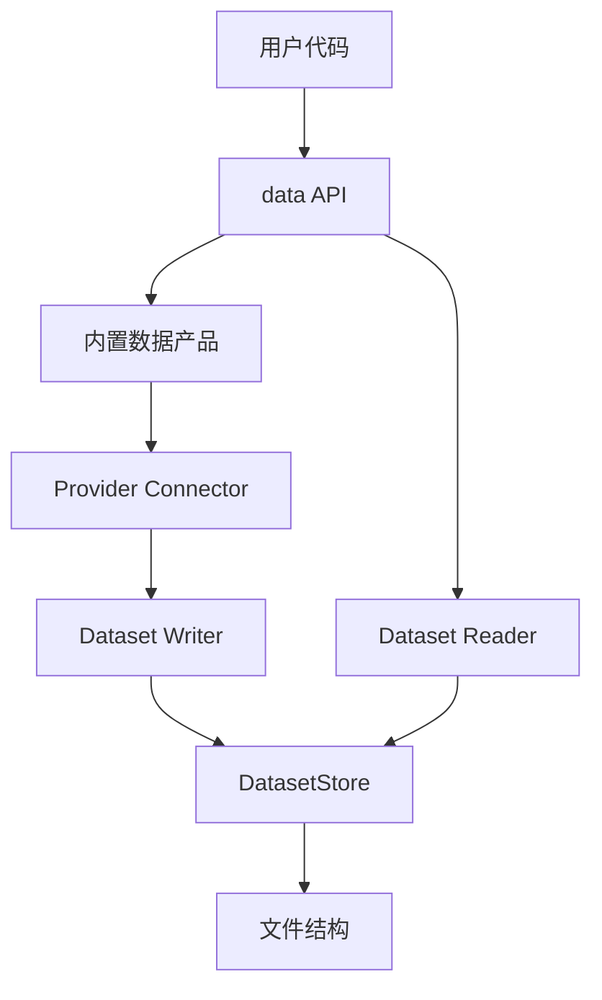

# Data 文件结构与读取体验设计草案

这版设计把 Data 收敛成单一 Dataset 数据目录、实时视图和统一 Reader/Writer，不引入额外 JSON 门槛。

Data 层只回答两个问题：

1. 数据有哪些。
2. 怎么读。

Dataset 是数据资产本身，不是运行环境配置。

## 1. 核心结论

1. 历史数据直接落在 Dataset 的 `data/` 目录下。
2. 实时数据直接落在 Dataset 的 `live/` 目录下。
3. 内置数据产品不允许用户自定义 Dataset 名字。Dataset ID 由产品 key 和 selector 自动生成。
4. Dataset 不知道运行环境、回测、生产、策略、账户。
5. SQLite 不是主存储，只能作为可删除、可重建的索引缓存。
6. hash、行数、quality、audit、manifest 完整性都不作为读取门禁。

## 2. 产品分层



### 2.1 读取体验

用户应该直接按 Dataset ID 读取时间序列数据：

```python
bars = data.read(
    "market.ohlcv.crypto.binance.usdm-perpetual.1h",
    instruments=["BTCUSDT"],
    start="2026-01-01",
    end="2026-02-01",
)

book = data.live("market.orderbook.crypto.binance.spot.btc-usdt")
```

Dataset ID 是数据地址，不是任务地址。

### 2.2 内置数据产品体验

内置数据产品解决供应商接入和标准化落盘，不让用户给产物命名。

```python
data.use(
    "hyperliquid.perpetual.ohlcv.1h",
    instruments=["BTC"],
    start="2026-01-01",
    end="2026-02-01",
)

# 自动写入：
# market.ohlcv.crypto.hyperliquid.perpetual.1h
```

实时连接：

```python
data.connect(
    "binance.orderbook",
    instruments=["BTCUSDT"],
    market="spot",
)

# 自动对应：
# market.orderbook.crypto.binance.spot.btc-usdt
```

短名字只应该是 alias：

```python
data.alias("market.orderbook.crypto.binance.spot.btc-usdt", "btc_book")
book = data.live("btc_book")
```

不提供这种入口：

```python
data.connect(
    "binance.orderbook",
    as_dataset="market.orderbook.crypto.binance.btc-usdt",
    instruments=["BTCUSDT"],
    market="spot",
)
```

## 3. Dataset 的边界

Dataset 应该知道：

- Dataset ID
- 数据类型，例如 ohlcv、trade、quote、orderbook、funding、open_interest
- asset class / venue / market / interval
- 数据文件目录
- 实时状态目录
- 默认 reader
- 可选的轻量描述信息

Dataset 不应该知道：

- 运行环境
- 回测任务
- 生产任务
- 策略 ID
- portfolio / account / execution profile
- provider credential
- 采集任务调度状态

如果运行系统需要固定某次输入，它应该在运行系统自己的记录里保存 Dataset ID、查询范围和必要参数。Data 层不承载这类运行状态。

## 4. 文件结构契约

DatasetStore 的核心是一套稳定、可读、可迁移的文件结构。

建议目标结构：

```text
.kairos/data/
  datasets/
    market/
      ohlcv/
        crypto/
          binance/
            usdm-perpetual/
              1h/
                dataset.json
                data/
                  event_day=2026-07-22/
                    part-00000.parquet
                    part-00001.parquet
                tmp/

      orderbook/
        crypto/
          binance/
            spot/
              btc-usdt/
                dataset.json
                live/
                  default/
                    state.json
                    capture/

  aliases/
    btc_book.ref

  index/
    cache.sqlite3
```

### 4.1 目录规则

- `datasets/...` 是真实 Dataset 路径。
- `data/` 是历史数据根目录。
- `live/` 是实时视图、实时状态或实时捕获根目录。
- `tmp/` 是写入临时目录，可以随时清理。
- `dataset.json` 是可选描述文件，只用于展示和发现，不参与读取门禁。
- `aliases/*.ref` 是用户短名，内容指向真实 Dataset ID。
- `index/cache.sqlite3` 是索引缓存，删除后可以从文件结构重建。

### 4.2 物理分区由产品决定

Data core 不规定 `data/` 下面必须按哪一层分区。它只规定：

- `data/` 下面是同一个 Dataset 的历史数据文件。
- Reader 必须能递归扫描 `data/`。
- 读到内存后是一张逻辑大表。
- 具体 partition 层级是内置产品的 writer/layout 决策。

常见布局可以是：

```text
data/
  event_day=2026-07-22/
    part-00000.parquet
```

高频数据可以更细：

```text
data/
  event_day=2026-07-22/
    event_hour=13/
      part-00000.parquet
```

高基数标的数据可以加 bucket：

```text
data/
  event_day=2026-07-22/
    instrument_bucket=4f/
      part-00000.parquet
```

低频或低数据量产品也可以更粗：

```text
data/
  event_month=2026-07/
    part-00000.parquet
```

这些都是存储优化，不进入 Dataset ID，也不改变读取 API。

### 4.3 历史数据写入

写入只是对 Dataset 的 `data/` 做 append 或 upsert。

建议提供两种 writer 模式：

```python
store.append(dataset_id, frame)
store.upsert(dataset_id, frame, key=("instrument", "event_time"))
```

append 适合明确不会重复的数据段。

upsert 适合供应商修正数据、补数、重复拉取同一时间段。实现上可以：

1. 根据时间字段定位受影响 partition。
2. 读取旧 partition 数据。
3. 与新数据按 key 合并。
4. 写入 `tmp/<run_id>/...`。
5. 用目录替换或文件替换更新对应 partition。
6. 清理临时目录。

这是一种写入策略，不改变 Dataset 身份。

### 4.4 实时数据写入

实时数据直接维护 Dataset 的 `live/`。

建议结构：

```text
live/
  default/
    state.json
    capture/
      event_date=2026-07-22/
        part-00000.parquet
```

`state.json` 只表达当前 live view 状态，例如连接状态、最近事件时间、订阅 instruments。它不是质量报告，也不是门禁文件。

如果实时数据需要沉淀成历史数据，可以由 writer 定期把 `live/default/capture/` compact 到 `data/`。

## 5. 说明文件降级

现有这些文件不应该继续作为核心契约：

- `schema.json`
- `lineage.json`
- `coverage.json`
- `quality.json`
- `manifest.json`
- `capabilities.json`
- `usage.json`

建议降级为：

- `dataset.json`：可选，轻量描述 Dataset。
- `source.json`：可选，记录供应商、symbol 映射、采集参数。
- `reader.json`：可选，只有默认 reader 无法从路径和文件推断时才需要。

读取链路应该优先看：

1. Dataset ID 或 alias。
2. 文件路径。
3. `data/` 或 `live/`。
4. parquet/csv 文件。

说明文件缺失时，最多影响展示，不影响读取。

## 6. 项目文件结构重构

建议把 `kairospy.data` 收敛成下面的层级：

```text
kairospy/data/
  __init__.py
  api.py
  ids.py
  layout.py
  store.py
  reader.py
  writer.py
  live.py

  products/
    __init__.py
    registry.py
    binance.py
    massive.py
    hyperliquid.py

  ingestion/
    __init__.py
    historical.py
    realtime.py

  formats/
    __init__.py
    parquet.py
    csv.py

  diagnostics.py

  legacy/
    __init__.py
    catalog_json.py
    contracts.py
```

### 6.1 API 层

```python
data.read(dataset, **query)
data.live(dataset, **query)
data.use(product, **selector)
data.connect(product, **selector)
data.alias(dataset, alias)
```

API 层只做输入规范化和调用转发。

### 6.2 ID 与路径层

`ids.py` 负责 Dataset ID：

```python
DatasetId("market.ohlcv.crypto.binance.usdm-perpetual.1h")
DatasetId("market.orderbook.crypto.binance.spot.btc-usdt")
```

`layout.py` 负责 Dataset ID 到目录的映射：

```python
dataset_id -> .kairos/data/datasets/market/ohlcv/crypto/binance/usdm-perpetual/1h/
data_path -> .../data/
live_path -> .../live/
```

### 6.3 Store 层

`store.py` 只负责文件结构操作：

```python
store.list_datasets()
store.resolve(dataset_or_alias)
store.dataset_path(dataset_id)
store.data_path(dataset_id)
store.live_path(dataset_id)
store.alias(dataset_id, alias)
```

Store 不知道策略、任务、运行环境。

### 6.4 Reader 层

`reader.py` 把 Dataset 读成统一数据结构：

```python
reader.read(dataset_id, start=None, end=None, instruments=None, columns=None)
reader.scan(dataset_id, start=None, end=None)
```

Reader 应优先从目录和数据文件推断：

- 文件格式：parquet / csv
- partition 字段：由产品 writer 决定，Reader 递归扫描并按查询条件裁剪
- symbol 字段：`instrument` / `symbol`
- 时间字段：`event_time` / `timestamp`

只有无法推断时才读取可选 `reader.json`。

### 6.5 Writer 层

`writer.py` 负责把标准数据写进 Dataset：

```python
writer.append(dataset_id, frame)
writer.upsert(dataset_id, frame, key=...)
writer.compact(dataset_id, partitions=None)
writer.clean_tmp(dataset_id)
```

Writer 可以做轻量的格式统一、partition 选择、去重和 compact，但不改变 Dataset 身份。

### 6.6 Products 层

`products/` 管内置数据产品。每个产品定义：

- product key
- selector schema
- selector 到 canonical Dataset ID 的映射
- connector 调用方式

示例：

```python
Product(
    key="binance.orderbook",
    mode="realtime",
    connector="binance",
    dataset=lambda s: DatasetId(
        f"market.orderbook.crypto.binance.{s.market}.{normalize_symbol(s.instrument)}"
    ),
)
```

产品层不允许用户传 `as_dataset`。

### 6.7 Ingestion 层

`ingestion/` 负责和供应商交互：

- historical：批量拉历史数据，调用 writer 写入 `data/`
- realtime：连接 websocket，维护 `live/`

采集层可以知道 provider credential 和采集参数，但这些不写进 Dataset 的核心身份。

### 6.8 Diagnostics 层

`diagnostics.py` 只做辅助检查，不做门禁。

可以提供：

```bash
kairospy data list
kairospy data inspect market.ohlcv.crypto.binance.usdm-perpetual.1h
kairospy data repair-index
kairospy data clean-tmp
```

不建议继续提供“缺少某个 JSON 就失败”的诊断。

## 7. 三个供应商的接入方式

### 7.1 Binance 实时数据

当前仓库已经有 Binance websocket/canonical stream 的基础，应优先把它接成内置产品：

```python
data.connect("binance.orderbook", instruments=["BTCUSDT"], market="spot")
data.live("market.orderbook.crypto.binance.spot.btc-usdt")
```

建议产品：

- `binance.orderbook`
- `binance.trade`
- `binance.quote`

Dataset ID：

- `market.orderbook.crypto.binance.spot.btc-usdt`
- `market.trade.crypto.binance.spot.btc-usdt`
- `market.quote.crypto.binance.spot.btc-usdt`

### 7.2 Massive 实时数据

当前 Massive 已有 websocket/canonical stream 代码，但还没有像 Binance 一样进入内置产品注册表。

建议产品：

- `massive.trade`
- `massive.quote`
- `massive.aggregate`

Dataset ID：

- `market.trade.us_equity.massive.aapl`
- `market.quote.us_equity.massive.aapl`
- `market.ohlcv.us_equity.massive.1m`

provider symbol 与 canonical instrument 的映射属于 product/connector，不属于用户命名。

### 7.3 Hyperliquid 实时与历史数据

Hyperliquid 建议作为新 connector 接入：

```text
kairospy/integrations/connectors/hyperliquid/
  __init__.py
  client.py
  websocket.py
  historical.py
  models.py
```

建议产品：

- `hyperliquid.perpetual.trade`
- `hyperliquid.perpetual.orderbook`
- `hyperliquid.perpetual.funding`
- `hyperliquid.perpetual.ohlcv.1m`
- `hyperliquid.perpetual.ohlcv.1h`

Dataset ID：

- `market.trade.crypto.hyperliquid.perpetual.btc`
- `market.orderbook.crypto.hyperliquid.perpetual.btc`
- `market.funding.crypto.hyperliquid.perpetual.btc`
- `market.ohlcv.crypto.hyperliquid.perpetual.1h`

历史数据写入 `data/`，实时数据维护 `live/`。两者共享 Dataset ID 规范，但目录语义分开。

## 8. 迁移策略

建议分三步做，避免一次性打散现有功能。

### 8.1 先加新 Store/Reader/Writer

新增：

- `kairospy/data/ids.py`
- `kairospy/data/layout.py`
- `kairospy/data/storage/store.py`
- `kairospy/data/storage/reader.py`
- `kairospy/data/storage/writer.py`

旧的 catalog、contracts 和写入链路先保留在兼容层，避免一次性破坏已有测试。

### 8.2 Reader 优先走新文件结构

读取顺序：

1. alias -> Dataset ID
2. Dataset ID -> 文件结构路径
3. `data/` -> parquet/csv reader
4. 如果新结构不存在，再 fallback 到旧 catalog

这样可以先改善用户读取体验，不被旧 JSON 契约卡住。

### 8.3 再迁移内置产品接入

迁移顺序建议：

1. Binance realtime：已有基础，最快验证新 `live/` 体验。
2. Massive realtime：已有 websocket，补产品注册即可。
3. Hyperliquid historical：新 connector，先验证 `data/` 写入。
4. Hyperliquid realtime：接入 `live/`。
5. 清理旧 JSON gate：等新 reader/store 稳定后再清理 diagnostics 和旧写入 adapter。

## 9. 需要保留的最小契约

删除大部分契约后，只保留这些稳定约定：

1. Dataset ID 规范。
2. Dataset ID 到文件路径的映射。
3. `data/` 历史数据目录。
4. `live/` 实时数据目录。
5. parquet/csv 的最小可读字段约定。
6. product key 到 Dataset ID 的映射规则。

这些契约是为了让用户能稳定读取数据，不是为了给数据加门禁。

## 10. 判断标准

这个重构完成后，应该满足：

- 用户不需要理解 catalog JSON。
- 用户不需要给内置产品起 Dataset 名。
- Dataset 缺少描述 JSON 也能读。
- 删除 `index/cache.sqlite3` 后系统能重建索引。
- 运行系统可以选择 Dataset 和查询范围，但 Dataset 本身不认识运行系统。
- 新供应商接入只需要实现 connector、product mapping 和 writer 调用，不需要新增一堆全局契约。
