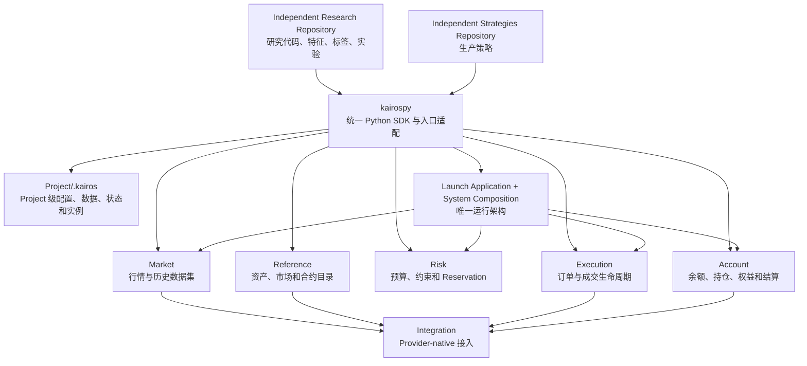
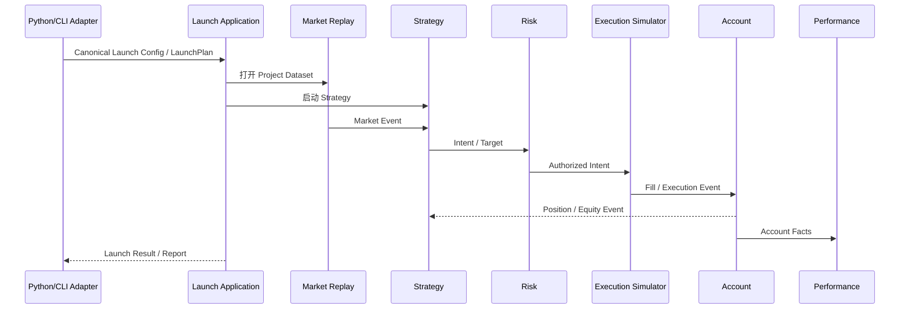

# Kairos 平台、Kairospy 与 Research 整体架构设计

## 1. 文档目的

本文定义 Kairos 面向研究、策略、回测、模拟交易和实盘交易的整体技术架构，重点固定以下问题：

- `kairospy` 在项目中的定位；
- Rust 业务模块与 Python SDK 的边界；
- 每个 Project 下 `.kairos` Workspace 的统一资源布局和隔离语义；
- Market 历史数据获取、准备、查询和回放机制；
- Research 与 Strategies 的职责边界；
- CLI、Python API 与现有 Launch + Config 架构的关系；
- Backtest、Paper 和 Live 的统一运行语义；
- SPY 期权作为第一条纵向切片时需要补齐的能力；
- 从当前实现迁移到目标架构的实施顺序。

本文描述目标架构和迁移方向，不表示其中所有能力均已实现。实施时仍应遵循 [AGENTS.md](../AGENTS.md) 中的模块边界、所有权和反过度设计规则。

## 2. 核心结论

Kairos 的整体定位是：

> 由 Rust 业务内核、现有 Launch + Config 运行架构、`kairospy` 统一 Python SDK、多个相互隔离的 `.kairos` Project，以及独立的 Research/Strategies 代码仓库组成的一体化量化交易平台。

其中：

- Rust 业务模块拥有领域事实、状态和交易语义；
- `kairospy` 是 Research 和 Strategies 的统一 Python SDK，并为现有 Application API 提供类型化便捷入口；
- 每个 Project 只拥有一个 `.kairos`；用户可以创建多个 Project，并通过各自的 `.kairos` 完全隔离配置、数据、状态、Reference、运行实例和日志；
- Research 和 Strategies 是独立代码仓库，不归属于某个 `.kairos` Project；
- Research 或 Strategy 在执行时显式选择一个 Project，所有数据访问、组件运行和运行产物进入该 Project 的 `.kairos`；
- 统一的是公共 API、Workspace 和运行编排，不是把所有业务实现集中到 Python；
- CLI 和 Python API 都只是现有 Launch + Config 架构的便捷入口，不能形成第二套启动、组装、生命周期或报告架构；
- Backtest、Paper 和 Live 应尽量复用相同的 Strategy、Market、Intent、Risk、Execution 和 Account 语义。



### 2.1 第一总原则：通路复用，语义分叉

整个项目遵循“通路复用、语义分叉”原则：从事实 Owner 到校验、规范化、身份、版本、持久化和 Application 用例，尽可能复用一条权威通路；只有调用入口、消费节奏或模式 Composition 确实具有不同语义时，才在边界处分叉。分叉后的各支路不得重新解释上游事实，也不得形成第二个状态 Owner。

这里的“复用”不是要求所有场景共享同一段物理执行代码，而是要求它们在语义分叉之前共享同一个权威模型和 Application 通路；这里的“分叉”也不是复制一套系统，而是在保留共同身份、事实、版本、Lineage 和审计契约的前提下，为不同消费语义提供专门执行形态。换言之：**能合流的必须合流，只有语义不同才允许分叉，分叉后仍须可证明来自同一条权威通路。**

判断一个设计是否符合该原则，可以依次检查：

1. 分叉之前是否已经复用了同一个权威类型、配置、身份、校验和 Application 用例；
2. 分叉是否由真实的消费语义驱动，而不是因为 CLI、Python、Research 或 Backtest 位于不同目录或语言；
3. 分叉支路是否只负责各自的输入/输出形态、读取节奏或具体 Composition；
4. 两条支路能否通过共同的 normalized representation、hash、manifest 或 contract test 证明上游语义一致；
5. 如果差异消失，分叉实现是否可以被删除，而不影响权威数据和运行模型。

当前架构有两个最重要的应用：

- 运行通路：CLI Config 与 Python Spec 在输入适配处分叉，随后立即合流到同一个 Canonical Launch Config、`LaunchPlan` 和 Launch Application；Backtest、Paper、Live 只在 Composition 选择处按模式分叉；
- 数据通路：Research 与 Backtest 复用相同的 Atomic Dataset、`DatasetSetRef`、Catalog、Resolver、校验、时间和 Point-in-time 语义，只在最终消费端分叉为 Snapshot/History View 与 Replay Stream。

### 2.2 一个 Launch 架构，多个便捷入口

现有 Launch + Config 架构保持不变。CLI、`kairospy` Python API、自动化任务和未来其他入口，都是同一组 Launch Application 用例的输入适配器，不是彼此独立的运行系统。

```text
TOML Config ──→ CLI Adapter ───────────┐
                                       ├─→ Canonical Launch Config / LaunchPlan
Python BacktestSpec ─→ Python Adapter ─┘              ↓
                                             Launch Application
                                                      ↓
                                       Instance + Composition + Lifecycle
                                                      ↓
                                      Status / Wait / Stop / Report
```

因此必须满足：

1. `kairos launch start <id>` 和 `await kairos.backtests.run(spec)` 最终进入相同的 Launch 配置校验、规范化、实例创建、Composition、生命周期、状态和报告用例；
2. `BacktestSpec` 是类型化的配置编写入口，不是新的 Backtest 运行模型；它必须可无歧义地转换为 Canonical Launch Config/`LaunchPlan`；
3. CLI 不拥有业务编排，Python API 也不拥有业务编排；二者只负责输入适配、调用 Launch Application 和输出呈现；
4. 不允许 CLI shell-out 到另一套 Python runner，也不允许 Python API 通过拼接 CLI 参数复制启动逻辑；二者应直接复用相同的 Application 能力；
5. Config 的默认值、校验、规范化和模式约束只能有一个权威实现；CLI 与 Python 不得各自解释一遍；
6. 无论入口为何，每次运行都必须在选定 Project 下生成相同结构的 normalized config、Launch/Instance identity、manifest、lifecycle、checkpoint、log 和 report；
7. 可以调整和共享实现细节，例如提取公共配置模型、validator、normalizer、launch client 和 result mapper，但不得改变现有 Workspace/System 所有权、Launch 边界和 `bin/surface → application → composition/services` 架构。

该原则不仅适用于 Backtest，也适用于 Paper、Live、由研究代码发起的多个 Launch 和数据准备任务；任何新增便捷入口都先映射到既有的配置与运行用例。平台不存在独立的 Research Job 运行模式。

## 3. 项目和仓库布局

平台源码仓库、Research/Strategies 代码仓库和运行 Project 是三个独立概念。

平台源码仓库布局如下：

```text
trader/
├── crates/                     # Rust 公共业务内核
│   ├── business/
│   │   ├── market/
│   │   ├── reference/
│   │   ├── risk/
│   │   ├── execution/
│   │   └── account/
│   ├── kairos-integration/
│   ├── kairos-workspace/
│   ├── kairos-transport/
│   └── kairos-domain-types/
├── kairospy/                   # 统一 Python SDK 和 Application 入口适配
├── schemas/                    # 跨语言传输契约
└── docs/
```

Research 和 Strategies 可以是任意位置的独立仓库：

```text
/repos/my-option-research/
/repos/my-option-strategies/
```

用户可以另外创建多个相互隔离的运行 Project：

```text
/workspace1/.kairos/
/workspace2/.kairos/
```

逻辑 Project Root 分别是 `/workspace1` 和 `/workspace2`；`.kairos` 是对应 Project 的控制与存储根。`Kairos.open("/workspace1")` 和 `Kairos.open("/workspace1/.kairos")` 应解析为同一个 Project。两个 Project 的 Dataset Catalog、Credential Reference、Reference State、Launch、Account 和运行进程默认不共享。

同一个 Research 或 Strategy 仓库可以先后连接不同 Project；同一个 Project 也可以运行来自不同独立仓库的 Research 或 Strategy。代码位置和运行 Project 之间是显式绑定关系，不是目录包含关系。

`kairospy` 近期继续位于公共 monorepo 中，不单独拆成 Git 仓库。它与 Rust Application API、schema、Workspace、Strategy runtime 和跨语言测试仍在共同演化；过早拆仓库会引入额外的版本兼容和发布协调。只有当公共 API 稳定、有独立发布需求且具备跨版本契约测试后，才重新评估拆分。

## 4. Rust 业务内核

每个 Rust 业务模块继续遵循标准布局：

```text
src/
├── bin/             # Server 和 CLI 入口
├── composition/     # Provider、Store、模式选择和具体组装
├── application/     # 公共业务用例和可选 Process facade
├── services/        # Actor、持久化、适配器和内部实现
└── domain/          # 实体、值对象和业务不变量
```

调用与构造方向：

```text
bin -> composition -> application -> services
                         \-> domain
```

`kairospy`、Research、Strategies、CLI 和其他业务模块只能通过 application API 进入，不得直接导入 `services/` 或其他私有实现。

### 4.1 业务所有权

| 模块 | 拥有的事实和状态 |
|---|---|
| Market | Quote、Trade、Bar、Greeks、OrderBook、订阅、freshness、历史市场数据集 |
| Reference | Asset、Instrument、Market、合约属性、生命周期、Provider identity mapping |
| Risk | 预算、授权、限额、Reservation、consume/release |
| Execution | Intent 执行、订单状态、成交、撤单、改单和执行审计 |
| Account | 余额、持仓、权益、成本、PnL、账户侧订单事实和结算 |
| Integration | Provider 认证、连接、协议和外部事实标准化 |
| Workspace/System | 路径、实例资源、进程生命周期、启动和跨模块组装 |
| Strategy | 交易决策和意图，不拥有订单、账户或市场权威状态 |
| Research | 特征、标签、假设、统计分析和实验结果 |

任何可变业务状态都必须只有一个 owner。`kairospy` 可以查询、命令和编排业务模块，但不得在 Python 中再维护一份权威 Market、Account、Execution 或 Risk 状态。

## 5. Kairospy 的定位

`kairospy` 是整个系统面向 Python 的统一中心，承担以下职责：

1. 为各业务 Application API 提供一致的 Python SDK；
2. 打开和管理 `.kairos` Workspace；
3. 隐藏 CLI、subprocess、Unix socket、FlatBuffers 和传输细节；
4. 提供 Strategy runtime 和公共 Strategy contract；
5. 将类型化 Python 请求适配到现有 Launch + Config Application，并提供 Backtest、Paper 和 Live 的便捷调用；
6. 提供历史数据集获取、准备、定位、验证和回放入口；
7. 为 Research 和 Strategies 提供稳定的业务类型、时间、数据和结果接口。

`kairospy` 不承担以下职责：

- 不成为第二套 Market、Reference、Risk、Execution 或 Account；
- 不复制 Rust Actor 的业务状态；
- 不直接拥有 Provider payload；
- 不保存具体私有策略或 Alpha；
- 不建立一套平行于现有 Launch + Config 的 runner、生命周期或报告系统；
- 不提供一个无边界的通用插件、Manager 或 Coordinator 平台。

正确依赖方向为：

```text
Research / Strategies
        ↓
     kairospy
        ↓
各业务模块 Application API
```

业务模块不依赖 `kairospy`。

### 5.1 统一顶层 API

目标 API 收敛到一个 `Kairos` 对象：

```python
from kairospy import Kairos

kairos = Kairos.open("/path/to/project")

kairos.workspace
kairos.data
kairos.market
kairos.reference
kairos.risk
kairos.execution
kairos.account
kairos.research
kairos.launches
kairos.backtests
```

示例：

```python
quote = await kairos.market.current.quote("SPY")

contracts = await kairos.reference.options.list(
    underlying="SPY",
    as_of="2025-01-02",
)

positions = await kairos.account.positions(account="paper-options")
```

调用者不应感知 Rust CLI 参数、subprocess、socket、FlatBuffers、内部 snapshot 路径或 Provider 原始结构。

这里的“隐藏 CLI 参数”不表示 Python API 取代或绕过现有 Launch 架构。CLI 与 Python API 是对等的 surface adapter；它们共同依赖 Launch Application，而不是互相调用。`kairos.backtests.run()` 必须先把 `BacktestSpec` 转换为权威 Launch 配置模型，再沿与 `kairos launch start/wait/report` 相同的应用链路执行。

### 5.2 Kairospy 内部组织目标

不要求一次性移动现有文件，但公共表面可逐步收敛为：

```text
kairospy/
├── __init__.py
├── surface/
│   ├── client/                # Kairos 与各 Python client adapter
│   │   ├── project.py
│   │   ├── data.py
│   │   └── research.py
│   └── cli/                   # 命令行 adapter；不调用 surface/client
├── application/               # CLI 与 client 共享的权威用例层
│   ├── data/
│   ├── research.py
│   └── launch/
├── research/                  # Research 公共 protocol/value contracts
├── strategy/                  # Strategy 公共 protocol/value contracts
└── infrastructure/            # transport、generated 与具体技术实现
```

公共调用者只能使用稳定的顶层模块。`surface/client` 和 `surface/cli` 是并列
adapter，共同调用 Application，禁止 CLI 通过 Python client 间接执行业务用例。
传输、生成代码和进程调用细节不得成为 Strategies 或 Research 的依赖。

## 6. Project 与 `.kairos` Workspace

每个 Project 有且只有一个 `.kairos` Workspace。Project 是数据、配置、组件和运行实例的隔离边界；`.kairos` 是 Project 内由 Kairos 管理的控制与存储根。Research 和 Strategies 代码独立于 Project，但 Research 执行、Strategy 执行、Backtest、Paper、Live 和所有业务组件必须在一个明确的 Project 上下文中运行。

```text
/repos/research-repo/       独立代码仓库
/repos/strategies-repo/     独立代码仓库

/workspace1/.kairos/       Project 1
/workspace2/.kairos/       Project 2
```

当前源码 checkout 中的 `.private/research` 和 `.private/strategies` 仍然是独立 Git 仓库；它们恰好位于源码目录下，不表示它们属于该目录中的 `.kairos`。平台不得依赖这种物理相邻关系。

```text
.kairos/
├── kairos.toml
├── config/
│   ├── launches/
│   └── market/
│       └── preparations/
├── data/
│   ├── market/
│   │   └── datasets/
│   └── research/
├── state/
│   ├── market/
│   └── research/
├── reference/
│   └── reference.sqlite
├── credentials/
├── run/
├── logs/
└── launches/
    ├── backtest/
    ├── paper/
    └── live/
```

目录职责：

- `data/market`：Market 拥有的长期、不可变市场数据集；
- `data/research`：某次 Research 在选定 Project 中发布的大型派生样本和缓存，不是 Research 源码；
- `state/market`：Catalog、Alias、下载断点、锁和 staging 状态；
- `reference`：Reference 权威数据库；
- `launches`：具体 Backtest、Paper 或 Live 实例的状态、快照、报告和 checkpoint；
- `run`：Socket、health 和 process lock；
- `logs`：Workspace 和实例日志。

共享历史数据集是 Workspace 级资源，不属于某次 Backtest instance。实例只保存数据集引用、回放 checkpoint，以及当前 reader 必需的临时 materialization。

Research 或 Strategy 启动时必须显式传入 Project，或通过明确的 CLI Project 参数选择：

```python
kairos = Kairos.open("/workspace1")
```

Launch 配置应记录 Strategy/Research 代码引用，例如 Python package、module、版本或 Git commit；不得假定代码位于 Project Root 下。运行产物进入当前 Project，但代码所有权和版本历史仍留在独立仓库。

### 6.1 多 Project 隔离

以下两个 Project 必须可以独立存在：

```text
/workspace1/.kairos
/workspace2/.kairos
```

默认隔离内容包括：

- `kairos.toml` 和所有配置；
- Dataset Catalog、Alias、Manifest 和本地数据文件；
- Reference Database 和 generation；
- Credential 引用和 Provider 配置；
- Account、Risk、Execution 和 Market 状态；
- Launch Instance、Socket、Lock、Checkpoint、Log 和 Report；
- Research 派生数据和实验状态。

跨 Project 复用数据必须是显式操作，例如导入一个带 Content Hash 的 Dataset、配置只读外部 Catalog，或以后增加受控共享缓存。任何模块都不得通过隐含父目录、全局默认 Catalog 或绝对路径旁路 Project 隔离。

### 6.2 Workspace-aware Application

历史数据 Application 应接收 `Workspace`，而不是一个含义不明确的裸 `Path`：

```python
history = HistoricalMarketApplication(workspace)
```

内部统一解析：

```text
workspace.paths.data_root()/market/datasets
workspace.paths.state/market
```

当前 `MarketDataApplication(owner.paths.state / "market")` 将长期数据和可变状态放在同一根目录，应在迁移过程中收敛到上述布局。

## 7. 历史数据和数据准备

目标数据链路：

```text
Provider Historical Capability
→ Acquire
→ Normalize
→ Validate / Prepare
→ Fine-grained Atomic Datasets
→ DatasetSetRef
   ├── Snapshot / History View
   ├── Replay Stream
   └── Inspection View
```

### 7.1 Acquire

Market 通过 Integration 的 provider-native historical capability 获取数据，负责：

- Provider 请求和分页；
- 错误、限流和安全查询重试；
- Provider payload 标准化；
- Canonical Market/Instrument identity；
- 映射为 Kairos MarketObservation；
- 输出可验证的来源数据集。

Research 不直接调用 Massive、Binance 或其他 Provider SDK，也不自己管理 Provider credential。

### 7.2 Canonical Dataset

Canonical Dataset 服务 replay、审计、通用保存和数据版本追踪。基础结构可以保留统一事件格式：

```text
kind
market_id
instrument_id
source_id
observed_at_unix_nanos
available_at_unix_nanos
payload_json
```

它追求语义完整和兼容性，不承担所有研究查询的性能要求。

### 7.3 声明式 Data Preparation

Market 的数据准备只包含通用、确定性操作：

- 时间裁剪；
- 按 Market、Instrument 和 observation kind 过滤；
- 稳定排序；
- 去重；
- 多页或多批次合并；
- Schema 和 identity 验证；
- 价格、数量和 Bar 不变量检查；
- Crossed Quote 和数据空洞检测；
- Parquet 分区；
- Analytical Projection；
- Lineage、Quality Report 和 Content Hash；
- Staging 后原子发布。

Data Preparation 不计算收益、IV-RV spread、Alpha、未来标签、相关性、参数搜索或策略 PnL。

准备计划应是声明式请求，而不是任意 Python callback：

```python
request = PrepareDatasetRequest(
    source_dataset="massive-spy-options-source-2025q1",
    target_dataset="massive-spy-options-2025q1-v1",
    observation_kinds=("quote", "greeks"),
    filters={"underlying": "SPY"},
    operations=(
        SortByEventTime(),
        Deduplicate(policy="source-event-identity"),
        RejectCrossedQuotes(),
    ),
    partition_by=("observation-kind", "event-date"),
)
```

相同来源数据和相同准备计划应产生可识别、可重建的确定性结果。

### 7.4 细粒度、类型化的原子 Dataset

一个研究或策略通常需要组合多种数据，因此不能把“SPY 期权研究数据”设计成一个不断膨胀的单体 Dataset。Catalog 中的持久化基本单元应是细粒度、类型化、不可变的原子 Dataset。

原子 Dataset 至少按以下维度分类：

| 维度 | 示例 |
|---|---|
| Owner | `market`、`reference` |
| Kind | `bar`、`quote`、`trade`、`option-greeks`、`open-interest`、`rate`、`option-contract`、`corporate-action` |
| Subject/Universe | `SPY`、`SPY options`、一个明确的 Market 集合 |
| Product | `equity`、`options`、`spot`、`futures` |
| Source | `massive`、`ibkr`、`binance` 或 Kairos 派生来源 |
| Venue/Market | 明确交易场所或 Canonical Market 集合 |
| Sampling/Cadence | Tick、1m、1h、daily snapshot |
| Time Range | 明确的半开区间或已封存 Partition 范围 |
| Schema/Semantics Version | Schema、时间和 Adjustment 语义版本 |

一个原子 Dataset 应尽量只承载一个稳定的业务事实族。例如：

```text
market.bar / SPY / 1d
market.quote / SPY options / tick
market.option-greeks / SPY options / snapshot
market.open-interest / SPY options / daily
reference.option-contract / SPY / point-in-time
reference.cash-dividend / SPY
reference.stock-split / SPY
market.rate / USD / tenor curve
```

原子 Dataset 的粒度需要足够清晰，使外部调用者可以发现、引用、替换或单独补齐某一类数据；但不应细到每个 Instrument、每日或每个文件都成为必须由用户手工管理的 Dataset。日期和 Instrument 通常是 Dataset 内部 Partition，除非其来源、语义或生命周期确实独立。

Market 仍拥有 Market Facts，Reference 仍拥有合约和 Corporate Action Facts。`kairospy` 可以提供统一 Catalog 和组合入口，但不能改变数据 Owner。

公司行动也应按事实类型细分，而不是用一个含义过宽的文件或表隐藏差异。以现金分红为例，除息日是事实作用时间（`observed_at`），声明日是该事实最早可用时间（`available_at`）；声明日缺失时必须显式采用并记录退化规则。用于收益研究的总回报或复权序列由 Research 将 Market Bar 与 Reference Cash Dividend 组合派生，不把派生收益改写成第二份 Market 权威事实。

### 7.5 Dataset Set 与“同源、同义、不同消费形态”

研究数据和回测数据不是两类 Dataset，也不建设两套数据系统。一个研究或 Backtest 可以引用多个原子 Dataset，并将它们解析为同一种固定版本的 `DatasetSetRef`。Snapshot/History View 和 Replay Stream 是同一个逻辑 Dataset Set 的两种消费形态：

```text
Data Requirements
      ↓
Project Dataset Resolver
      ↓
DatasetSetRef
├── market.bar:SPY
├── market.quote:SPY-options
├── market.option-greeks:SPY-options
└── reference.option-contract:SPY
      ↓
├── Snapshot View      研究使用的完整有界快照、查询和批量扫描
├── Replay Stream      Backtest 使用的有序事件流
└── Inspection View    Coverage、Quality 和 Lineage
```

`DatasetSetRef` 是一组原子 Dataset 引用和组合规则的不可变快照，本身不要求复制底层数据。它应固定每个成员的 Dataset ID、Version 和 Content Hash，以及时间对齐、冲突处理和 Replay 排序策略。

两种消费形态必须共享：

- 相同的 Dataset 成员、版本、Content Hash 和 Composition Hash；
- 相同的时间范围、Point-in-time、Reference Snapshot 和 Adjustment 语义；
- 相同的 Schema、Canonical Identity、质量过滤、冲突处理和 Tie-breaker 定义；
- 相同的 Coverage/Quality 结论和缺失数据错误；
- 相同的底层 Dataset Reader 能力和 Read Plan。

只允许在消费边界处分叉：

| Snapshot / History View | Replay Stream |
|---|---|
| 面向 Research | 面向 Market Replay / Backtest |
| 返回一个完整的、有界逻辑快照 | 按 Event Time 逐步输出事件 |
| 支持列裁剪、过滤、Join 和聚合 | 支持 Cursor、Checkpoint、Pause/Resume 和 EOF |
| 可暴露 LazyFrame/Table/RecordBatch | 暴露有序 Stream/Iterator 给 Market Actor |
| 不推进仿真时钟 | 每批或每个事件推进统一仿真时钟 |

“完整快照”表示调用者可以访问给定 Dataset Set 和时间窗口内的完整有界视图，不表示必须一次性把所有数据复制进 Python 内存。实现可以继续使用 Lazy Scan、Record Batch、memory map、Predicate Pushdown 和分区裁剪。

Snapshot 与 Replay 不能各自实现一套 Join、时间过滤或数据清洗规则。共同逻辑先形成不可变 `DatasetReadPlan`，再由 Snapshot Reader 或 Replay Reader 执行各自的读取节奏；若 Replay 需要额外排序索引或 materialization，它只是一种内部物理优化，不能改变逻辑结果。

Research 和 Backtest 只需要关心：

- 需要哪些 Subject、Market Type 和 Selector；
- 时间范围；
- Point-in-time 和 Quality Policy；
- 每个原子 Dataset 的 ID、Version 和 Content Hash；
- Dataset Set 的成员、Coverage 和组合规则；
- 可用 Coverage 和质量结论。

它们不需要关心：

- JSONL 还是 Parquet；
- Canonical 和 Projection 的目录；
- Parquet 分区字段和文件数量；
- Replay 是否需要 instance-local materialization；
- Reader 使用哪个底层文件。

建议的公共类型为：

```python
@dataclass(frozen=True)
class DataRequirement:
    owner: str
    kind: str
    subject: str
    start: datetime
    end: datetime
    source: str | None = None
    cadence: str | None = None
    as_of_semantics: str = "point-in-time"
    quality_policy: str = "validated"


@dataclass(frozen=True)
class DatasetRef:
    dataset_id: str
    owner: str
    kind: str
    version: str
    content_hash: str


@dataclass(frozen=True)
class DatasetSetRef:
    members: tuple[DatasetRef, ...]
    composition_hash: str
```

单个 `DatasetRef` 和组合后的 `DatasetSetRef` 都不暴露文件路径。

统一的 Market Data Application 可以提供：

```text
DataApplication
├── catalog.list/filter/describe(...)
├── plan(requirements)
├── resolve(requirements)
├── execute(acquisition_plan)
├── ensure(requirements)
├── inspect(dataset_ref)
├── validate(dataset_ref)
├── history(dataset_set_ref)
└── replay(dataset_set_ref, replay_policy)
```

统一的 `kairos.data.catalog` 是外部清晰的数据入口，负责按 Owner、Kind、Subject、Source、Cadence、时间 Coverage 和质量状态发现数据；具体读写和验证仍委托给 Market 或 Reference Application。这组能力已有 Research、Strategy/Backtest 两个明确调用者。

### 7.6 Resolve、Plan 与下载执行

Research 不感知物理存储细节，但系统不能在一个只读查询中静默下载大量数据或产生 Provider 费用，因此必须区分：

```python
requirements = (
    DataRequirement(owner="market", kind="bar", subject="SPY", ...),
    DataRequirement(owner="market", kind="quote", subject="SPY-options", ...),
    DataRequirement(owner="market", kind="option-greeks", subject="SPY-options", ...),
    DataRequirement(owner="reference", kind="option-contract", subject="SPY", ...),
)

datasets = await kairos.data.resolve(requirements)
```

`resolve()` 只在当前 Project Catalog 中寻找可以组合后满足全部 Requirement 的原子 Dataset。覆盖不足时返回结构化 Missing Coverage，不发起网络请求。

本地缺失时，先生成可审查的下载和准备计划：

```python
plan = await kairos.data.plan(requirements)
```

`DataAcquisitionPlan` 至少说明：

- 已满足和缺失的 Requirement；
- 每个缺失时间区间和数据 Kind；
- 将使用的 Provider capability 和 Source；
- 所需 Credential ID、许可或订阅限制；
- 已知时的请求数量、预计大小、费用和限流信息；
- Acquire、Normalize、Validate、Prepare 和 Publish 步骤；
- 计划生成的原子 Dataset ID 和目标 Project；
- 不可获取的数据、降级方案和阻塞原因。

计划生成是只读操作。下载必须由显式写操作执行：

```python
datasets = await kairos.data.execute(plan)
```

便捷接口：

```python
datasets = await kairos.data.ensure(
    requirements,
    acquire_missing=True,
)
```

`ensure()` 等价于 Plan 后显式执行，不能在默认只读查询中静默下载。执行过程应支持进度、失败后安全恢复、已完成 Partition 复用和最终原子发布，并返回固定版本的 `DatasetSetRef`。

## 8. 控制面与数据面

历史数据采用两个平面：

```text
便捷入口：CLI / kairospy Python API
    ↓
控制面：既有 Application API
    Launch + Config / catalog / plan / resolve / execute / validate / history / replay

内部数据面：Project-scoped, domain-owned Storage
    Atomic Datasets / Canonical Events / Projections / Replay Index
```

CLI 和 Python API 在控制面上只做请求适配。对运行类请求，两者必须进入同一个 Launch + Config Application；对数据类请求，两者必须进入相同的数据 Owner Application。便捷 API 可以组合多个调用，但不能成为新的状态 Owner 或运行架构。

`kairospy` 返回原子 Dataset 引用或组合后的 Dataset Set，而不是物理文件列表。Research 从 Dataset Set 打开 Snapshot/History View：

```python
requirements = (
    DataRequirement(owner="market", kind="bar", subject="SPY", ...),
    DataRequirement(owner="market", kind="quote", subject="SPY-options", ...),
    DataRequirement(owner="market", kind="option-greeks", subject="SPY-options", ...),
    DataRequirement(owner="reference", kind="option-contract", subject="SPY", ...),
)

dataset_set = await kairos.data.resolve(requirements)
snapshot = dataset_set.snapshot(start="...", end="...")

quotes = snapshot.scan("quote")
greeks = snapshot.scan("greeks")
```

`scan()` 可以返回 Polars LazyFrame 或其他受支持的 Lazy Query，但路径、分区和文件 Schema 由 `kairospy` 内部管理。Polars、DuckDB 和 PyArrow 保持为可选依赖，避免污染最小 Strategy runtime。

Backtest 使用同一 Dataset Set 引用：

```python
result = await kairos.backtests.run(
    BacktestSpec(
        strategy="spy_put_spread.strategy:SpyPutSpread",
        data=dataset_set.reference,
    )
)
```

这段代码是现有 Launch + Config 架构的类型化便捷入口。`BacktestSpec` 中的 `DatasetSetRef`、Strategy、Account、Risk Profile、时间窗口和 Seed 会进入同一 Canonical Launch Config/`LaunchPlan`，随后复用既有 Launch 实例与生命周期链路；它不会启动一套独立 Python Backtest runner。Launch 内的 Market Replay 从同一个 Dataset Set 和 `DatasetReadPlan` 打开 Replay Stream，Research 与 Backtest 因而不会发生数据定义漂移。

History 和 Replay 不通过 Python 对象、HTTP 或 Unix socket 逐条复制亿级数据。底层可以继续使用 Parquet、列裁剪和 Predicate Pushdown，但这些属于内部 Data Plane。

## 9. 内部物理表示与 Reader

同一逻辑 Dataset 可以包含多种内部物理表示：

```text
canonical/
    通用 MarketObservation，服务 replay 和审计

projections/quotes/
    展开的 Quote 列，服务研究查询

projections/greeks/
    展开的 Greeks 列

projections/bars/
    展开的 Bar 列

replay/
    可选的排序索引、Cursor 元数据或 Reader 辅助文件
```

Canonical、Projection、Parquet、JSONL 和 Replay materialization 都属于数据 Owner 的内部实现。公共 `DatasetRef`、`DatasetSetRef`、History View 和 Replay Source 不承诺这些路径或格式稳定。只有诊断接口可以查看物理存储，Research 和 Strategy 不得依赖诊断结果。

SPY 期权 Quote Projection 可包含：

```text
event_date
observed_at_unix_nanos
available_at_unix_nanos
market_id
instrument_id
bid_price
ask_price
bid_size
ask_size
source_id
```

Greeks Projection 可包含：

```text
implied_volatility
delta
gamma
theta
vega
underlying_price
derivation
```

为了查询方便，Projection 可以冗余 Reference 字段，例如 underlying、expiry、strike、option right 和 multiplier，但必须记录来源的 `reference_snapshot_id`。Reference 仍然是这些合约事实的唯一 owner。

### 9.1 History Reader

History/Snapshot Reader 面向研究和批量查询，返回指定 Dataset Set 与时间窗口的完整有界逻辑快照，优化目标为：

- 列裁剪和 Predicate Pushdown；
- 时间、Market 和 Instrument 过滤；
- Polars/DuckDB Lazy Query；
- 批量扫描；
- Coverage 和 Quality 查询；
- 不要求逐事件推进。

### 9.2 Replay Reader

Replay Reader 面向 Backtest 和确定性回放，将同一逻辑快照按确定顺序转为事件流，必须提供：

- Event-time 推进；
- 相同时间事件的稳定 Tie-breaker；
- 不提前读取未来事件；
- Cursor、Checkpoint 和 Resume；
- Replay Window；
- Pause/Resume 和 EOF；
- 相同 Dataset、Replay Policy 和 Seed 产生相同事件序列。

History/Snapshot Reader 与 Replay Reader 共享 Dataset、Catalog、Resolver、`DatasetReadPlan` 和业务语义，但保持不同的输出契约、读取节奏和性能模型。Research 查询不需要通过仿真事件循环，Replay 也不依赖 Research DataFrame。对相同 Dataset Set 和窗口，Replay Stream 消费完成后观察到的事实集合必须与 Snapshot View 一致；差异只能来自明确记录的 Replay Policy，且必须有一致性测试证明。

### 9.3 Backtest 不接受物理文件路径

目标 Backtest API 接受一组 `DataRequirement` 或固定版本的 `DatasetSetRef`，不接受公共 `replay_file` 路径：

```python
BacktestSpec(
    data=DatasetSetRef(
        members=(...),
        composition_hash="...",
    )
)
```

内部流程为：

```text
DatasetSetRef
→ Resolve
→ Validate
→ Open Replay Reader
→ Drive Market Actor
```

当前为兼容 Rust Replay Reader 而生成的 instance-local `replay.jsonl` 是过渡期内部实现，不能成为 Research、Strategy 或 BacktestSpec 的公共数据接口。Launch Instance 只持久化 Dataset Set 成员、Composition Hash、Replay Window 和 Checkpoint。

## 10. Point-in-Time 时间语义

研究数据至少区分：

```text
observed_at
    市场事实发生的时间

available_at
    消费者最早可以使用该事实的时间

ingested_at
    Kairos 获取或写入该事实的时间
```

研究特征必须满足：

```text
feature.available_at <= observation_time
```

标签必须满足：

```text
label.start_time > observation_time
```

如果 Provider 无法提供可靠的 available time，Manifest 必须明确标记 `availability_semantics = "unknown"`，不能隐式将 observed time 当作 available time。Open Interest、日线、Greeks 和修订数据尤其需要严格处理。

## 11. Dataset Manifest 和发布规则

Manifest 是数据集的权威描述，`datasets.json` 只是可重建索引。

```json
{
  "schema_version": 1,
  "dataset_id": "market-quote-massive-spy-options-2025q1-v1",
  "owner": "market",
  "kind": "quote",
  "subject": "SPY-options",
  "product": "options",
  "provider": "massive",
  "source_id": "massive-options",
  "cadence": "tick",
  "parents": ["market-quote-massive-spy-options-source-2025q1"],
  "reference_snapshot_id": "reference-generation-42",
  "start_time_unix_nanos": 0,
  "end_time_unix_nanos": 0,
  "event_count": 0,
  "instrument_count": 0,
  "preparation_plan": {},
  "preparation_plan_hash": "...",
  "content_hash": "...",
  "quality_status": "passed",
  "quality_report": "quality-report.json",
  "created_at": "..."
}
```

Manifest 描述一个原子 Dataset，不把 Quote、Greeks、Bar、Reference Contracts 和 Corporate Actions 合并成一个 Kind。研究或 Backtest 使用单独的 Dataset Set 描述固定组合：

```json
{
  "schema_version": 1,
  "dataset_set_id": "spy-option-research-2025q1-v1",
  "members": [
    {"dataset_id": "market-bar-spy-daily-v1", "content_hash": "..."},
    {"dataset_id": "market-quote-massive-spy-options-2025q1-v1", "content_hash": "..."},
    {"dataset_id": "market-option-greeks-spy-options-2025q1-v1", "content_hash": "..."},
    {"dataset_id": "reference-option-contract-spy-2025q1-v1", "content_hash": "..."}
  ],
  "composition_policy": {
    "time_alignment": "point-in-time",
    "conflict_policy": "reject",
    "replay_tie_breaker": "owner-kind-source-instrument"
  },
  "composition_hash": "..."
}
```

Dataset Set 描述可以由研究计划或 Launch 配置持久化，但不复制成员数据。

发布过程：

1. 写入 staging；
2. 完成 Schema、Identity 和质量验证；
3. 生成 Hash、Quality Report 和 Manifest；
4. 原子性发布；
5. 已发布 Dataset 不允许原地修改；
6. 修复数据时发布新版本；
7. Alias 可以移动，Dataset ID 不变。

## 12. Research 的定位

Research 是独立于 Project 的私有代码仓库。以下 `.private/research` 只是当前开发环境中的一个实例路径：

```text
.private/research/
├── src/
│   └── kairos_research/
│       ├── datasets/
│       ├── features/
│       ├── statistics/
│       └── evaluation/
├── studies/
│   └── spy_options/
├── notebooks/
├── tests/
├── reports/
└── pyproject.toml
```

Research 只依赖 `kairospy`，并在每次运行时显式打开目标 Project。它通过该 Project 的 Data Catalog 使用公共数据资源，负责：

- Point-in-time join；
- Feature 和 Label；
- Realized Volatility、Option Surface、Skew 和 Term Structure；
- Correlation、Bootstrap 和显著性检验；
- Walk-forward 和样本外稳定性；
- 快速研究模拟；
- 实验元数据和研究报告。

Research 不负责 Provider 下载、Canonical identity、Market Dataset Catalog、生产订单、权威账户状态、生产 Risk 或真实撮合语义。

相关性工具属于 Research，而不是 Market。只有在多个真实研究项目重复使用后，才考虑将机械性、稳定且无 Alpha 含义的部分提取到公共 `kairospy`。

### 12.1 Research 公共契约与 Client Surface

Research 应与 Strategy 一样拥有独立、稳定、清晰命名的公共契约包
`kairospy.research`。该包只导出 Research 所需的 Protocol、Spec、Policy 和
request/result value，不导出 `ResearchClient`、Application、持久化或运行时实现。
Python 操作入口由 `Kairos.research` 提供，其实现位于 `surface/client`。
Research 不是运行时，也不存在 `Research.run`、`ResearchContext`、Research Host、
Research Process 或 Research Launch mode。研究代码就是独立 Research 仓库中的普通
Python、Notebook 和测试；它主动调用公共 API：

Research Application 的核心含义严格限定为三项：

1. **便捷操作 Data**：提供与 `kairos.data` 相同、绑定同一 Project 的数据入口，方便研究者发现、准备、组合、固定和读取 Dataset；不复制 Data Application，不暴露物理存储，也不绕过数据 Owner。
2. **便捷启动 Launch**：提供与 `kairos.launches` 相同的 Launch 入口，以及建立在 Launch + Config 之上的类型化 Backtest 和有界批量调用；每一次执行仍是 Canonical Launch，不存在 Research 自己的 runner、实例或生命周期。
3. **规定研究规范**：通过 `ResearchSpec`、不可变计划锁、参数空间、试验预算、固定 Dataset/Seed、Holdout 纪律和 Research Gate 约束可复现性并保存证据；这些规则只验证和约束研究过程，不接管 Data 或 Launch 的执行职责。

因此，Research Application 是一个面向研究者的**便利与治理边界**，而不是新的业务 Owner、运行时或编排系统。`ResearchClient` 只负责将 Project 绑定到这些用例。凡是无法归入上述三项的能力，默认不进入 Research Application；应先回到其业务 Owner 或现有 Application 判断归属。

```text
独立 Research 代码仓库
  ├── import kairospy.research contracts
  └── 调用 Kairos.research / Kairos.data
                 ↓
surface/client/{research,data}.py
                 ↓
Research Application / Data Application / Launch Application
```

这里的关键调用方向是：

```text
Research code
→ kairos.research.run_backtests
→ Research Application
→ Backtest Application
→ Canonical Launch Config / LaunchPlan
→ Launch Application
→ Strategy / Risk / Execution / Account
```

Research 可以为了参数敏感性、成本场景或稳健性检验多次调用 Launch，也可以有界并发运行多个独立 Backtest。每个案例必须具有唯一 Case ID 和 Launch ID，固定完整 `BacktestSpec`、参数和 Seed；批量结果保留输入顺序，并把每个失败明确保存为失败结果。`max_concurrency` 是研究者显式给出的资源上限，不能通过另一套进程管理器绕过 Launch 的实例、账户和资源隔离。

示例：

```python
from dataclasses import replace
from kairospy import BacktestCase

baseline = BacktestSpec(...)
batch = await kairos.research.run_backtests(
    locked_research_spec,
    (
        BacktestCase(
            case_id="profit-exit-40",
            spec=replace(
                baseline,
                launch_id="spy-put-spread-profit-40",
                strategy_params={"profit_exit": 0.40},
            ),
            params={"profit_exit": 0.40},
        ),
        BacktestCase(
            case_id="profit-exit-50",
            spec=replace(
                baseline,
                launch_id="spy-put-spread-profit-50",
                strategy_params={"profit_exit": 0.50},
            ),
            params={"profit_exit": 0.50},
        ),
    ),
    max_concurrency=2,
)
```

在查看 Holdout 前，允许搜索的参数范围、选择准则和最大试验次数必须写入锁定的 `ResearchSpec` 或研究计划 Artifact。Holdout 阶段不得继续根据结果修改参数；并发只改变执行调度，不能改变 Dataset、Launch、Strategy 或统计语义。

因此，“Research 门面类似 Strategy”只表示研究者获得一个稳定、面向业务的公共模块；不表示复制 Strategy 的生命周期、事件回调、Actor、进程或 Launch。Research 直接使用 Snapshot/Analytical 数据进行统计，需要正式交易语义时再调用统一 Backtest/Launch 通路。这一方向才符合“通路复用、语义分叉”。

## 13. Strategies 的定位

Strategies 是独立于 Project 的代码仓库；当前 `.private/strategies` 只是一个实例路径。它保存通过研究验证后的最小生产策略逻辑。Strategy：

- 使用 `kairospy.strategy` 公共生命周期；
- 订阅 Market；
- 查询 Reference 和 Account；
- 产生 Intent 或 Target；
- 使用统一 Clock；
- 不区分底层是 Backtest、Paper 还是 Live；
- 不直接调用 Provider SDK；
- 不维护权威持仓；
- 不自己结算成交；
- 不导入业务模块的 `services/`；
- 不直接把 Notebook 当生产策略运行。

策略成熟链路：

```text
Research Hypothesis
→ Research Simulation
→ Canonical Backtest
→ Paper
→ Small Canary
→ Live
```

## 14. 统一 Backtest 架构

Canonical Backtest 应复用真实业务语义：



现有 Launch Application/System Composition 是跨模块运行边界，负责：

- 创建 `.kairos/launches` instance；
- 选择 Market replay；
- 启动 Strategy；
- 选择 Risk policy；
- 选择 Execution simulator；
- 选择模拟 Account settlement；
- 推进统一时钟；
- 等待完成并收集结果。

它不拥有 Market、Order、Risk 或 Account 业务状态。

`kairospy.backtests` 是其 Python 便捷 facade，只负责：

- 将 `BacktestSpec` 适配为 Canonical Launch Config/`LaunchPlan`；
- 调用与 CLI 相同的 Launch Application start/wait/status/report 能力；
- 将统一 Launch Report 映射为 `BacktestResult`。

CLI surface 也遵循相同限制。允许把当前 CLI 内可复用的配置校验、实例准备或生命周期调用下沉到现有 Launch Application，以消除重复；这属于共享实现细节，不改变 Launch + Config 的架构、Owner 或公共语义。

### 14.1 Research Simulation 与 Canonical Backtest

两者必须明确区分：

| Research Simulation | Canonical Backtest |
|---|---|
| 位于私有 Research | 位于公共 Kairos 平台 |
| Polars/NumPy 快速筛选 | Market Replay 驱动 |
| 允许明确标注的近似 | 复用 Risk、Execution、Account 语义 |
| 主要验证假设 | 验证策略可运行性和交易结果 |

使用 Mid Price、忽略部分成交或简化结算的结果不能直接称为生产级回测。

## 15. Backtest、Paper 与 Live 的一致性

三种模式复用：

- Strategy API；
- MarketObservation；
- Intent；
- Risk request/result；
- Order lifecycle；
- Account position/equity；
- Clock abstraction；
- Event envelope；
- Report schema。

差异只由 composition 选择：

| 模式 | Market | Execution | Account |
|---|---|---|---|
| Backtest | Historical Replay | Simulator | Simulated Settlement |
| Paper | Live Market | Paper Execution | Paper Account |
| Live | Live Market | Provider Execution | Broker/Exchange Account |

Strategy 不根据运行模式选择具体 Provider、Store 或 Execution 实现。

## 16. SPY 期权第一条纵向切片

SPY 期权用于验证整套架构，但第一阶段应控制范围：

- Provider：Massive；
- Underlying：SPY；
- 时间范围：先一个月；
- 数据：SPY Bar/Quote、Option Quote，Greeks 后续加入；
- DTE：优先 7 至 45 天；
- 采样：固定每日时刻或明确的原始频率；
- Reference：SPY 期权 Point-in-time 合约目录；
- 输出：Canonical Dataset、Quote Projection 和 Quality Report；
- Research：IV、RV、Skew 和 Term Structure；
- 策略：优先固定风险 Vertical Spread；
- Backtest：保守 Bid/Ask、手续费、滑点和到期结算。

第一条验收链路：

```text
kairos.data.plan / execute
→ Fine-grained Atomic Datasets
→ DatasetSetRef
→ History View / Replay Source
→ Research 使用 Polars/DuckDB
→ 形成候选假设
→ kairospy.backtests.run
→ Paper
```

在 Provider 能力、逐笔数据质量、成交建模和日内 Gamma 风险尚未验证前，不建议将 0DTE 作为第一条策略切片。

## 17. 当前基础与主要缺口

当前已经具备的重要基础：

- Market 的 Quote、Trade、Bar、Greeks、OrderBook 和 Replay 骨架；
- Reference 的期权 Coverage 和合约目录；
- Rust 历史 Bar 下载；
- JSONL/Parquet ingest；
- Dataset Manifest 和 Replay materialization；
- Python Strategy runtime；
- SPY Bar 回测示例；
- Execution、Risk、Account 的基础业务边界；
- `.kairos` Workspace 和实例资源模型。

主要目标差距：

1. 历史下载当前主要仍以 Bar 为主；
2. 缺少 SPY 历史 Option Quote/Greeks 完整切片；
3. Market 长期数据和可变 State 路径尚未完全分离；
4. 缺少细粒度 Dataset 分类、组合 Resolver 和声明式 Acquisition Plan；
5. 缺少完整 Point-in-time 时间语义；
6. 当前 Parquet 结构主要依赖 `payload_json`，研究查询效率有限；
7. Manifest 缺少完整 Lineage、Hash 和 Reference Snapshot；
8. 期权回测缺少完整多腿成交、结算、手续费和 Margin；
9. Account Ledger、PnL 和期权到期处理仍需完善；
10. `kairospy` 尚未收敛到统一顶层 `Kairos` facade。

## 18. 实施路线

### 阶段一：统一 Kairospy 公共入口

- 增加 `Kairos.open()`；
- 固定独立代码仓库与 Project 运行上下文的绑定方式；
- 验证多个 `.kairos` Project 的路径、状态和进程隔离；
- 暴露 Workspace、Market、Reference、Risk、Execution 和 Account；
- 定义稳定 Request/Result 类型；
- 屏蔽 Subprocess、Socket 和 Transport；
- 增加禁止 Strategies/Research 导入内部实现的架构测试。

### 阶段二：统一 Data Catalog 和 Historical Application

- Historical Application 改为接收 Workspace；
- 长期数据进入 `.kairos/data/market`；
- Catalog 和下载状态留在 `.kairos/state/market`；
- 定义 DataRequirement、DatasetRef、DatasetSetRef 和 Manifest v1；
- 定义共享 `DatasetReadPlan`，并在消费边界提供 Snapshot/History Reader 与 Replay Reader；
- 定义原子 Dataset 分类和 Coverage 规则；
- 提供 Catalog 发现、Resolve、Plan 和 Execute；
- 增加 Staging、验证和原子发布；
- 保持现有 Replay 兼容。

### 阶段三：通用 Data Preparation

- Filter、Merge、Sort、Deduplicate；
- Partition 和 Analytical Projection；
- Quality Report；
- Lineage 和 Hash；
- 确定性重建测试。

### 阶段四：SPY 期权数据

- 验证 Provider 历史能力和许可边界；
- 实现 SPY Option Quote 获取；
- 关联 Reference Snapshot；
- 先完成小时间范围真实数据验收；
- 再增加 Greeks、Trade 和 Open Interest。

### 阶段五：统一 Backtest

- 保持现有 Launch + Config 架构和 Workspace/System 所有权不变；
- 定义 BacktestSpec 和 BacktestResult，并实现与 Canonical Launch Config/`LaunchPlan` 的无损适配；
- 让 CLI 与 Python API 复用同一配置校验、规范化、实例创建、生命周期和报告 Application 用例；
- 复用 Market Replay；
- 接入 Risk；
- 接入 Execution Simulator；
- 接入 Account Settlement；
- 记录确定性轨迹和运行元数据。

### 阶段六：期权交易语义

- Multiplier；
- 多腿 Intent；
- Combo 与逐腿成交；
- 部分成交；
- 手续费和 Margin；
- 到期结算；
- 提前行权/指派；
- 分红影响；
- 保守滑点模型。

### 阶段七：独立 Research 和 Strategies

- 建立独立 Research 仓库，并显式连接一个测试 Project；
- 完成第一个 SPY 期权研究；
- 通过 Canonical Backtest；
- 将最小策略迁移到独立 Strategies 仓库；
- 完成 Paper 和小资金验证。

## 19. 架构验收原则

每一阶段至少验证：

- Strategies 和 Research 只依赖 `kairospy` 公共 API；
- 无跨模块 `services/` 导入；
- Application API 不暴露 Provider payload、Store record 或 Service instance；
- 每个 Project 恰好一个 `.kairos`，多个 Project 相互隔离；
- Research/Strategies 代码仓库独立于 Project，运行时显式选择 Project；
- Workspace Dataset 与 Launch Instance 生命周期分离；
- 相同 Dataset Set 和 Preparation Plan 可得到确定性结果；
- 相同 Dataset Set、时间窗口和 Read Plan 的 Snapshot 事实集合与 Replay 完整消费结果一致；
- Feature 和 Label 满足 Point-in-time 约束；
- Backtest、Paper 和 Live 使用相同 Strategy contract；
- CLI Config 与等价 Python Spec 生成相同的 normalized config 和运行计划；
- CLI 与 Python 启动路径复用相同 Launch Application，不存在第二套 runner；
- Market、Risk、Execution 和 Account 各自只有一个状态 owner；
- 数据准备和 Research 特征计算没有越过所有权边界。

实现后仍需运行受影响模块的聚焦测试，以及仓库要求的完整检查：

```text
cargo test --workspace
uv run pytest -q
cargo fmt --all -- --check
git diff --check
```

## 20. 最终交付与验收要求

新架构必须通过两个连续的最终交付验证，而不是分别提供一个 Notebook 和一条回测收益曲线：

```text
可信的 SPY 期权原子 Dataset Set
→ 完整、可证伪的期权研究
→ 明确的策略规格
→ Strategy / Risk / Execution / Account
→ 可复现的完整回测
```

两个交付共同遵循以下要求：

1. 可复现：给定全部 DatasetRef、Composition Hash、代码版本、配置和 Seed，可以重新生成相同结果；
2. Point-in-time 正确：所有 Feature、合约选择和信号只使用当时可见的信息；
3. 成本保守：主结果不得只使用 Mid Price；
4. 全链路可追踪：从 Dataset、Signal、Intent、Risk、Order、Fill 到 Account PnL 均可关联；
5. 边界正确：Research 和 Strategy 只使用 `kairospy` 公共 API；
6. 范围明确：未实现的 Assignment、Expiry、Margin 或执行语义必须显式限制，不能静默近似；
7. 工程完成不以盈利为条件：研究可以拒绝假设，策略回测也可以亏损，但方法和交易语义必须可信。

### 20.1 交付一：完整的 SPY 期权研究

第一项研究建议采用简单、可证伪且能自然进入固定风险策略的主题：

> SPY 30 至 45 DTE、约 25 Delta Put 的隐含波动率是否系统性高于之后的实现波动率，并且这种差异在考虑 Bid/Ask、市场状态和样本外区间后是否仍然稳定？

研究可进一步回答：

- SPY Put Skew 是否稳定存在；
- Put IV 与未来实现波动率之间的关系；
- 观察到的差异是否足以覆盖可交易价差、手续费和额外滑点；
- 结果是否只存在于特定波动率状态或样本内区间。

第一版不同时研究大量信号、DTE、Delta 和复杂 Regime，也不以 0DTE 作为首个研究范围。

#### 20.1.1 数据要求

SPY 标的数据至少包含：

- 未复权价格和用于收益研究的复权序列；
- Quote 或固定频率 Bar；
- 分红、除息日和交易日历；
- Canonical Market/Instrument ID。

SPY 期权数据至少包含：

- Point-in-time 合约目录；
- Expiry、Strike、Option Right、Multiplier 和 Contract Status；
- Bid/Ask 和可用的 Bid/Ask Size；
- Volume 和具有可靠历史语义时的 Open Interest；
- IV、Greeks、Greeks 来源和 Derivation；
- Observed Time、Available Time 和 Source ID。

第一轮开发可以用一个月的小数据集验证管线；正式研究原则上应覆盖至少 24 个月、多个到期月份和不同波动率状态。数据范围不足时必须在报告中声明，不能通过重叠窗口或重复采样制造虚假的大样本。

#### 20.1.2 数据质量要求

至少检查：

- 选中合约与 Reference 的匹配；
- Market/Instrument ID、时间和数据类型；
- Bid/Ask 关系、负价格和负数量；
- 时间倒序、重复事件和数据空洞；
- 每个交易日、Expiry、DTE 和 Delta 区间的覆盖；
- Greeks、Entry Quote 和 Exit Quote 的缺失率；
- 合约生命周期与到期日一致性；
- 所有异常数据的数量、原因和处置结果。

最低验收要求：

```text
Reference 匹配率             100%
关键 Identity 和时间完整率  100%
选中样本有效 Bid/Ask 覆盖率 >= 95%
所有异常数据                必须计数并进入 Quality Report
```

不允许静默 Forward-fill 期权报价。允许使用最近 Quote 时，必须定义最大 Stale Window，并将实际 Staleness 写入样本。

#### 20.1.3 研究方法要求

在查看最终 Holdout 前固定：

- Observation Time；
- DTE 和 Delta 范围；
- ATM 定义；
- Realized Volatility 窗口；
- 流动性过滤；
- 缺失数据处理；
- 训练、验证和 Holdout 时间区间；
- 统计检验和成本模型。

Feature 与 Label 必须满足：

```text
feature.available_at <= observation_time
label.start_time > observation_time
```

研究结果至少包含：

- Put IV、ATM IV、Put Skew 和未来实现波动率；
- IV-RV 差异及其 Rolling 结果；
- 不同市场状态下的结果；
- 样本内和样本外结果；
- Bootstrap 置信区间或等价的稳健统计；
- 样本量、缺失率和数据覆盖；
- 简单无条件基准；
- Mid、保守 Bid/Ask、手续费和压力滑点四种成本结果。

Mid Price 只能作为敏感性上界，不能作为主结果。研究模拟必须声明多腿是否同时成交、Quote Stale Window、无有效 Quote 时的处理、手续费、滑点和退出规则。

#### 20.1.4 研究交付物

```text
.private/research/
└── studies/
    └── spy_put_skew/
        ├── README.md
        ├── research-plan.yaml
        ├── src/
        │   ├── sample.py
        │   ├── features.py
        │   ├── labels.py
        │   └── analysis.py
        ├── notebooks/
        ├── tests/
        ├── reports/
        │   ├── data-quality.md
        │   └── final-report.md
        └── results/
            └── summary.json
```

最终报告必须说明研究问题、全部原子 Dataset 和版本、Composition Hash、Point-in-time 语义、数据质量、样本构造、统计方法、基准、样本内/样本外结果、成本敏感性、局限、结论和可复现命令。

#### 20.1.5 Research Definition of Done

- Research 仓库独立于 Project，并在运行时显式打开目标 Project；
- 从目标 Project Catalog 解析固定版本的 DatasetSetRef；
- 只使用 `kairospy` 公共接口；
- 每个原子 Dataset 具备 Manifest、Hash、Lineage 和 Quality Report；
- Dataset Set 记录全部成员和 Composition Hash；
- Point-in-time 和无未来信息测试通过；
- 样本构建可以重复执行；
- 存在固定 Holdout 和简单基准；
- 主结果使用保守交易成本；
- 同一输入重复执行得到相同结果；
- 研究结论明确标记为接受、拒绝或证据不足；
- 提供完整报告和复现入口。

### 20.2 交付二：可完整回测的 SPY 期权策略

为了和研究结果连续，同时控制第一版风险，策略建议采用固定风险的 SPY Put Credit Spread。

第一版可以固定为：

```text
Underlying        SPY
Structure         Put Credit Spread
Short Put         约 25 Delta
Long Put          约 10 Delta，或固定宽度保护腿
Entry DTE         30 至 45
Entry Time        每周固定交易日和固定时刻
Maximum Positions 同时最多一个 Spread
Profit Exit       收取权利金的固定比例，例如 50%
Time Exit         到期前 14 至 21 天
Risk Exit         固定最大亏损或 Short Leg Delta 阈值
Expiry Handling   第一版禁止持有到期
Dividend Handling 除息窗口前退出或禁止开仓
```

第一版规则应在 Holdout 回测前固定，不进行大范围参数寻优。

#### 20.2.1 合约选择

合约选择必须确定性地：

1. 查询当时有效的 SPY Option Contracts；
2. 按 Expiry、DTE、Option Right 和有效 Bid/Ask 过滤；
3. 选择最接近目标 Delta 的 Short Put；
4. 选择保护腿；
5. 在距离相同时使用明确的 Tie-breaker；
6. 保存被考虑、被选中和被拒绝的合约及原因。

不得使用未来成交量、未来 Open Interest、最终到期表现或之后重新计算的 Delta 选择历史合约。

#### 20.2.2 多腿 Intent 和 Execution

Strategy 不直接提交两个无关联的单腿订单，而应产生一个业务上的多腿 Intent：

```text
OptionSpreadIntent
├── Sell SPY Put A
├── Buy SPY Put B
├── Quantity
├── Minimum Net Credit / Maximum Net Debit
├── Account ID
├── Strategy ID
└── Parent Intent / Correlation ID
```

Execution 拥有两腿订单生命周期、Package 或逐腿执行方式、部分成交、一腿失败后的处理、撤单、补偿、Fill Correlation 和执行审计。

第一版可以限定为确定性的 Package Execution，但必须明确该限制。主回测使用保守成交模型：

```text
Sell Leg Fill <= Bid
Buy Leg Fill  >= Ask
```

模拟器还必须处理 Contract Multiplier、每腿手续费、额外滑点、Quote Freshness、无有效报价时拒绝、不同事件上的 Entry/Exit，以及固定 Seed。订单不能使用触发决策的当前事件进行回溯成交。

至少提供：

```text
baseline_conservative
stress_costs
```

两个执行场景。

#### 20.2.3 Risk 和 Account

Risk 至少检查：

- 最大 Spread 数量和最大单笔亏损；
- 账户可用资金和策略风险预算；
- 单标的和组合暴露；
- Quote Freshness 和合约有效性；
- DTE 和到期限制；
- 全局 Kill Switch。

Risk 拒绝必须可查询、可追踪，Strategy 不得绕过。

Account 至少正确处理：

- Contract Multiplier；
- Entry/Exit Premium；
- 每腿手续费和滑点；
- Position Quantity；
- Realized/Unrealized PnL；
- Cash Movement 和 Equity Curve；
- Maximum Loss；
- Position Close；
- Strategy、Intent、Order、Fill 与 Account Transaction 的关联。

第一版如果禁止持有到期，可以暂不声称支持完整 Assignment，但必须在配置和报告中声明，并在到期前强制退出。数据不足导致无法退出时，回测必须失败或使用显式的压力结算规则，不能静默丢弃仓位。只有实现美式期权提前行权、Assignment、除息和实物交割后，才可以声称完整支持持有到期的 SPY 期权策略。

#### 20.2.4 Canonical Backtest

策略必须通过统一入口运行：

```python
result = await kairos.backtests.run(
    BacktestSpec(
        strategy="spy_put_spread.strategy:SpyPutSpread",
        data=DatasetSetRef(
            members=(...),
            composition_hash="...",
        ),
        account="spy-options-paper",
        risk_profile="options-conservative",
        start="...",
        end="...",
        seed=42,
    )
)
```

该调用与下面的 CLI 运行在架构上等价：

```text
BacktestSpec
→ Canonical Launch Config / LaunchPlan
→ validate / normalize
→ create instance
→ start / wait
→ report

config/launches/spy-put-spread-backtest.toml
→ Canonical Launch Config / LaunchPlan
→ validate / normalize
→ create instance
→ start / wait
→ report
```

两条链路从 Canonical Launch Config 开始必须合流。程序化调用可以不要求用户预先手写一个命名 TOML 文件，但必须把等价的规范化配置及其 hash 持久化到 Launch Instance；同一有效配置、Dataset Set、代码版本和 Seed 应产生相同的运行语义。CLI 配置也可以加载 `DatasetSetRef`，不得继续把物理 replay 文件路径当成长期公共接口。

目标运行链路：

```text
Market Replay
→ Strategy
→ Multi-leg Intent
→ Risk
→ Execution Simulator
→ Fill
→ Account Settlement
→ Backtest Report
```

Strategy 不能自行计算最终 PnL 并绕过 Risk、Execution 或 Account。

回测报告至少包含：

- Total/Annualized Return、Max Drawdown、Sharpe/Sortino；
- Realized/Unrealized PnL、Fee 和 Slippage Cost；
- Spread 数量、Win Rate、Average Win/Loss 和 Profit Factor；
- Premium Captured、Maximum Position Loss 和 Average Holding Period；
- Entry/Exit DTE 和 Delta；
- Fill Rejection、Quote Missing 和 Risk Rejection；
- Baseline 与 Stress Cost 结果。

每笔交易必须能够关联：

```text
Strategy Decision
→ Market Event
→ Reference Contract
→ Intent
→ Risk Decision
→ Order
→ Fill
→ Account Transaction
→ Position
→ PnL
```

#### 20.2.5 策略测试和交付物

至少提供：

- Unit Tests：DTE、Delta、Tie-breaker、无有效合约、除息窗口、退出规则和重复事件；
- Contract Tests：只使用公共 `kairospy`、Intent 类型、Clock 和 Backtest/Paper API 一致；
- Execution Tests：双腿成交、无 Quote、价格限制、拒绝、Fee、Multiplier 和 Stress Slippage；
- End-to-end Test：用固定 Fixture 跑通 Market Replay、Strategy、Risk、Execution、Account 和 Report；
- Determinism Test：相同 Dataset、配置和 Seed 得到相同结果；
- Entry Parity Test：等价 TOML Config 与 `BacktestSpec` 得到相同 normalized config、`LaunchPlan`、实例 artifact schema 和报告 schema；
- Boundary Test：CLI/Python surface 不复制默认值、校验、Composition 或生命周期逻辑，只调用公共 Launch Application。

策略目录建议为：

```text
.private/strategies/
└── spy_put_spread/
    ├── README.md
    ├── pyproject.toml
    ├── src/
    │   └── spy_put_spread/
    │       ├── strategy.py
    │       ├── selection.py
    │       └── config.py
    ├── configs/
    │   ├── backtest.toml
    │   └── paper.toml
    ├── tests/
    └── reports/
        └── baseline-backtest.md
```

选定 Project 的 `.kairos` 中保存 Dataset、Launch 配置和运行实例：

```text
.kairos/data/market/datasets/...
.kairos/config/launches/spy-put-spread-backtest.toml
.kairos/launches/backtest/spy-put-spread/instances/...
```

#### 20.2.6 Strategy Definition of Done

- Strategy 只依赖公共 `kairospy`；
- 代码仓库独立于 Project，并在运行时显式选择 `.kairos` Project；
- 使用正式 DatasetSetRef 固定全部原子 Dataset 版本；
- 合约选择满足 Point-in-time；
- 使用多腿 Intent 并经过 Risk；
- Execution Simulator 使用明确、保守的成本语义；
- Account 正确处理 Multiplier、Fee、Position 和 PnL；
- 不使用同事件回溯成交；
- 相同 Dataset、配置和 Seed 产生相同结果；
- Unit、Contract、Execution 和 End-to-end 测试通过；
- 提供完整 Backtest Report；
- 同一 Strategy contract 可以切换到 Paper；
- 所有未实现语义和运行限制均写入配置与报告。

### 20.3 公共平台前置能力

| 优先级 | 公共能力 | Owner |
|---|---|---|
| P0 | 多 Project 发现、选择和隔离 | Workspace/Kairospy |
| P0 | Workspace-aware Historical Market Application | Market/Kairospy |
| P0 | 细粒度 Dataset 分类和统一 Catalog | Kairospy/各数据 Owner |
| P0 | DataRequirement、DatasetRef 和 DatasetSetRef | Kairospy |
| P0 | Missing Coverage 和 DataAcquisitionPlan | Kairospy/Integration |
| P0 | SPY 历史 Option Quote 获取 | Market/Integration |
| P0 | Point-in-time Reference Snapshot | Reference |
| P0 | Dataset Manifest、Hash、Lineage 和 Quality | Market |
| P0 | Analytical Quote/Greeks Projection | Market |
| P0 | `Kairos.open()` 和显式 Project 绑定 | Kairospy |
| P0 | Multi-leg Option Intent | Execution Application |
| P0 | 保守 Option Execution Simulator | Execution |
| P0 | Multiplier、Fee 和 Spread Position 结算 | Account |
| P0 | Canonical BacktestSpec/BacktestResult | Kairospy/System |
| P1 | 历史 Greeks 或可重复 Greeks 计算 | Market |
| P1 | Margin 和组合风险 | Risk/Account |
| P1 | Assignment、Exercise 和 Expiry | Execution/Account |
| P1 | Paper Option Execution | Execution Composition |

第一版可以通过以下显式限制降低 P1 范围：

- 不持有到期；
- 不跨除息窗口持有 Short Put；
- 同时最多一个 Spread；
- 使用确定性的 Package Fill；
- 不做裸卖；
- 不做 0DTE；
- 不做动态 Delta 对冲。

这些限制必须进入 Strategy Spec、Backtest 配置和最终报告。

### 20.4 四个交付 Gate

最终验收按以下 Gate 顺序进行：

#### Gate 1：数据可信

```text
SPY Atomic Dataset Set
+ 清晰的 Kind/Owner/Coverage
+ 每个成员的 Manifest 和 Content Hash
+ Composition Hash
+ Lineage 和 Quality Report
+ Point-in-time Contract
```

#### Gate 2：研究可信

```text
固定、可证伪假设
+ 固定 Holdout
+ 简单基准
+ 保守交易成本
+ 可复现研究报告
```

#### Gate 3：策略语义完整

```text
Strategy
→ Multi-leg Intent
→ Risk
→ Execution
→ Account
```

#### Gate 4：运行一致

```text
同一个 Strategy Contract
→ Backtest 可确定性运行
→ Paper 可启动
→ 不绕过 Kairospy 公共 API
```

只有四个 Gate 全部通过，才能认为这套新架构完成了第一条 SPY 期权业务纵向切片。

## 21. 最终架构原则

1. 第一总原则是“通路复用、语义分叉”：权威事实和 Application 通路只保留一份，仅在真实消费边界分叉；
2. 现有 Launch + Config 是唯一运行架构；CLI、Python API 和自动化都只是它的便捷入口；
3. `kairospy` 是唯一 Python 公共入口，但不得建立第二套 runner、生命周期或报告链路；
4. 研究数据与回测数据使用同一 Dataset 架构、`DatasetSetRef` 和 `DatasetReadPlan`，只在消费端分叉为 Snapshot/History View 与 Replay Stream；
5. 每个 Project 恰好拥有一个 `.kairos`，多个 Project 默认完全隔离；
6. Research 和 Strategies 是独立代码仓库，运行时显式绑定 Project；
7. 统一的是 API、数据入口和运行编排，不是业务状态所有权；
8. 数据以细粒度、类型化、不可变的原子 Dataset 发布；
9. Research 和 Backtest 通过固定版本的 DatasetSetRef 组合多个 Dataset；
10. 本地缺失数据先生成可审查的 DataAcquisitionPlan，再显式下载；
11. Market 负责可信市场事实和数据集，不负责 Alpha；
12. Reference 负责合约事实，Market Projection 只引用或显式冗余；
13. Research 负责特征、标签、统计和假设；
14. Strategy 负责决策和意图；
15. Risk 负责授权、预算和约束；
16. Execution 负责订单与成交生命周期；
17. Account 负责余额、持仓、PnL 和结算；
18. Canonical Dataset 服务 Replay 和审计；
19. Analytical Projection 服务大规模研究查询；
20. `kairospy` 走控制面，物理数据格式留在各数据 Owner 内部；
21. Dataset Preparation 必须确定性、可追踪、可重建；
22. 已发布 Dataset 不可原地修改；
23. Backtest、Paper 和 Live 共享业务类型与 Strategy contract；
24. 不提前建设无当前调用者的插件、DAG、Manager、Protocol 或分布式数据平台；
25. 第一条真实调用链以 SPY 期权纵向切片完成验证。

最终形态为：

```text
Rust 业务内核
    提供正确的业务语义和状态所有权

kairospy
    提供统一 Python SDK、Workspace 工具，以及对 Launch + Config 的类型化便捷入口

.kairos Project
    为一次明确运行上下文提供隔离的数据、配置、状态和实例资源

Research
    作为独立代码仓库，连接选定 Project 后发现和验证规律

Strategies
    作为独立代码仓库，连接选定 Project 后承载已经验证的交易决策
```

这套架构既服务当前的 SPY 期权研究，也为股票、期货、加密货币、多策略组合、Backtest、Paper 和 Live 提供一致的扩展路径，同时避免在 Research 或 `kairospy` 中重新建设一套平行交易系统。
