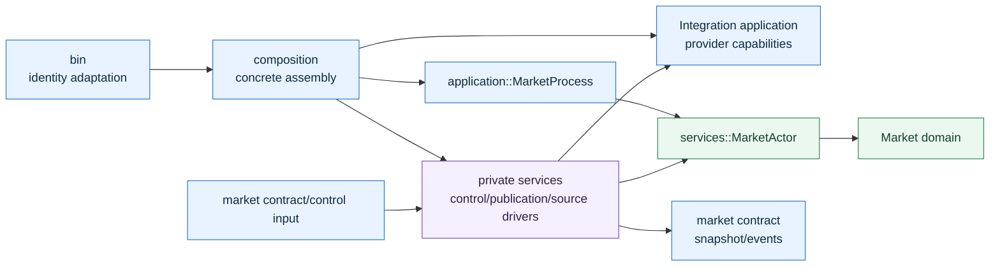

# Market 目标架构与迁移计划

## 1. 文档用途

本文定义 Market 业务组件的定位、运行参数、进程架构、内部实现边界和迁移计划。
它是 Market 改造的目标架构基线，不记录某一次提交的临时实现状态。

> **架构修订：** live/paper Market 的 source 选择、构造、readiness 和配置模型已由
> [`market-demand-driven-source-lifecycle-design.md`](market-demand-driven-source-lifecycle-design.md)
> 修订为订阅驱动的按需生命周期。本文中关于 runtime profile 静态选择
> `required_sources` / `optional_sources`、启动时构造全部 source 和 source-global business
> readiness 的内容仅作为迁移历史；与修订文档冲突时，以修订文档为准。

Integration 的 provider connection、capability、command/query/stream、恢复和交付语义以
[`integration-session-and-operation-design.md`](integration-session-and-operation-design.md)
为准；跨模块所有权以 [`module-boundaries.md`](module-boundaries.md) 为准。本文只定义
Market 如何组合和驱动 Integration 能力，以及如何拥有自己的业务状态。

当前改造的目标不是把现有 `MarketFeed` 从 blocking 改成 async，而是删除同步/异步双轨
运行模型，形成一个由单一 Market Actor 集中处理业务状态、多个 Integration I/O driver
并发驱动外部连接的清晰组件。

## 2. 架构结论

### 2.1 Market 的定位

Market 是一个市场数据业务运行组件，拥有：

- 策略和系统提交的订阅意图；
- Reference canonical market 到 provider source 的显式映射；
- normalized observation、order book 和 market view；
- 每个 source、market 和 data kind 的 freshness；
- Market 业务事件、snapshot generation 和 event sequence；
- required/optional source 聚合后的业务 readiness；
- order-book gap 后的单 market resync 决策。

Market 不拥有：

- provider 认证、签名、SDK payload 和协议 normalizer；
- WebSocket/FIX 的底层连接状态机和 provider sequence 实现；
- canonical instrument、listing 或 market identity；
- historical 文件目录和通用数据下载工具；
- Integration capability registry 或跨业务共享 provider socket；
- Execution、Account 或 Risk 的业务状态。

### 2.2 单 Actor 运行模型

Market 只有一个业务运行核心：`MarketActorTask -> MarketApplication -> MarketActor`。其中
`MarketActorTask` 只是唯一 Tokio task 的 mailbox/select 驱动器，`MarketApplication` 只是
use-case facade，所有业务状态、source handle projection、pending request 和公平轮询游标都由
`MarketActor` 持有。三者是一条所有权链，不是三层 Runtime，也不存在第二份业务状态。

每个 provider connection 可以有一个独立 Tokio I/O driver。driver 是 Integration async
capability 的调用者和 socket 驱动器，不是第二个业务 Runtime，不拥有订阅意图、order
book、freshness 或 readiness 聚合。

```text
control commands ------\
reference changes ------> MarketActor event loop -> snapshot/event publication
maintenance timers -----/          ^
                                  |
              bounded SourceInput channel
                 ^          ^          ^
                 |          |          |
       Binance / OKX / Massive / Hyperliquid I/O + Replay producer
                 |          |
          Integration async capabilities
```

### 2.3 Async-first，不保留双轨业务 facade

生产 Market server 只运行 async 模型。blocking projection 只允许用于明确的 CLI、离线下载
和同步测试工具，不进入 live Market server 的默认运行路径。

迁移完成后删除：

- `MarketFeed` / `AsyncMarketFeed` 双接口；
- `MarketConnectionManager` / `AsyncMarketConnectionManager` 双 manager；
- live provider 使用的 `MarketFeedWorker`；
- `MarketRuntime` 中同步/异步 optional connection 分支；
- `start_feed*`、`poll_feed*` 和 tick 驱动的 live feed drain；
- 作为 connection directory 和线程容器存在的 `CompositeMarketFeed`。

Replay 也进入同一个 Actor 输入模型，但保留确定性 clock、checkpoint 和 completion 语义。

## 3. 状态所有权

Mutable state 必须有且只有一个 owner。

| 状态 | Owner | 说明 |
|---|---|---|
| static/dynamic subscription intent | MarketActor | 业务权威状态 |
| resolved subscription members | MarketActor | 根据 Reference 投影解析 |
| source route 选择 | MarketActor | 属于 Market 业务组合和订阅决策 |
| provider subscription handle 映射 | MarketActor | 用 request identity 与 driver ack 更新 |
| observation、view、order book | MarketActor | Market 权威业务状态 |
| freshness、generation、event sequence | MarketActor | 与业务事实一起更新 |
| required/optional source readiness | MarketActor 派生 | 不由独立 manager 保存第二份聚合状态 |
| provider socket、认证和 channel epoch | Integration capability / I/O driver | provider 协议状态 |
| provider subscription protocol | Integration capability / I/O driver | Actor 只保存 normalized handle 映射 |
| process path、lock、instance resource | Workspace/System composition | 不进入 Market domain |
| event client queue | publication service | 每个 consumer 独立有界队列 |

`feed_status` 不再由多个 facade 直接调用 `actor.set_feed_status` 修改。source 状态只能通过
Actor 的 `SourceInput::StatusChanged` 输入更新；整体 readiness 从 Actor 保存的 per-source
状态派生。

## 4. 运行参数设计

### 4.1 参数分层

运行参数分为三个层次，不再由一个 `--provider` 字符串同时表达运行模式、provider、产品和
transport。

#### 进程身份与资源定位

生产 `kairos-market-server` CLI 只保留启动进程所需的稳定身份：

- `--workspace`；
- `--launch-mode`；
- `--launch-id`；
- `--instance-id`；
- 可选 `--runtime-profile`。

socket、snapshot、event transport、Reference transport、credential root 和 state path 由
Workspace/System composition 根据身份推导。

以下参数不再作为生产 server 的常规配置接口：

- `--provider`；
- `--endpoint`；
- `--credential-id`；
- `--replay-file`；
- `--once`；
- provider-specific product 字符串。

直连、一次性调用、historical download 和 provider 调试属于 `kairos-market-cli`。Replay
文件由 launch config 解析成 instance-owned resource，再交给 Market composition。

#### Workspace source binding

Workspace 定义可用 source binding。source ID 是稳定的 Market source identity；每个
binding 使用 provider-native 配置 variant，不使用包含大量 optional 字段的通用
`WorkspaceMarketSourceConfig`。

目标 Rust 模型示意：

```rust
enum WorkspaceMarketSourceBinding {
    BinanceSpot(BinanceSpotMarketBinding),
    BinanceDerivatives(BinanceDerivativesMarketBinding),
    Massive(MassiveMarketBinding),
    Okx(OkxMarketBinding),
    Hyperliquid(HyperliquidMarketBinding),
}
```

每个 variant 只包含当前 provider/product 所需字段，例如 environment、connection domain、
endpoint override、credential reference 和 provider-specific channel config。它们由
composition 显式转换成 Integration 定义的 provider-native config。

不得重新引入通用 `ConnectionSpec`、capability enum dispatch 或任意 provider payload map。

#### Runtime profile

Runtime profile 定义一个 Market 进程使用哪些 source 以及运行策略，不定义 provider 协议。
它至少包含：

- `scope = shared | instance`；
- required source ID；
- optional source ID；
- freshness policy；
- Actor 输入队列和 publication 队列策略；
- snapshot/freshness maintenance cadence；
- shutdown timeout；
- replay clock policy（仅 instance replay）。

示意配置：

```toml
[live.market]
scope = "shared"
profile = "primary-live"

[market.profiles.primary-live]
required_sources = ["binance-spot"]
optional_sources = ["massive-equity"]
snapshot_interval_ms = 1000
freshness_check_interval_ms = 250
shutdown_timeout_ms = 5000
```

Launch config 只选择 profile 或 instance replay resource；不重复 endpoint、secret 或
provider connection 细节。

### 4.2 时间参数必须按语义拆分

现有 `refresh_ms` 不再同时驱动 provider ingest、Reference 恢复、snapshot 发布和 replay。

- live source event：由 Integration async future ready 时立即进入 Actor；
- snapshot publication：`snapshot_interval`；
- freshness evaluation：`freshness_check_interval`；
- Reference gap recovery：由 Reference change/gap 触发，失败时使用独立 bounded backoff；
- subscription reconciliation：由 intent、Reference 或 source epoch 变化触发；
- replay：由 replay clock 和 speed policy 驱动；
- shutdown：使用独立 `shutdown_timeout`。

## 5. 运行架构

### 5.1 Process composition

正常构造流保持：

```text
bin -> composition -> application process facade -> MarketActor
                    -> Integration concrete capabilities
                    -> publication/control implementations
```

`bin` 只解析身份、打开 Workspace、获取锁并调用 composition。provider 分支、credential
解析、endpoint 默认值和 feed 构造从 binary 移入 composition。

Composition 的输出应是一个完整 `MarketProcess`，而不是要求 binary 逐步执行
`attach_feed`、`start_feed_worker` 或 `with_reference_*`。

### 5.2 MarketActor event loop

Actor event loop 集中处理：

```rust
loop {
    tokio::select! {
        command = control_commands.recv() => { /* business command */ }
        input = source_inputs.recv() => { /* provider fact/status/ack */ }
        change = reference_changes.recv() => { /* reference reconcile */ }
        _ = snapshot_tick.tick() => { /* publish projection */ }
        _ = freshness_tick.tick() => { /* evaluate freshness */ }
        _ = shutdown.cancelled() => { /* ordered shutdown */ }
    }
}
```

Actor turn 内不得执行长时间 provider I/O。subscribe、unsubscribe、resync 和 reconnect 以
`SourceCommand` 发送给对应 driver，结果通过带 request identity 的 `SourceInput` 返回。

### 5.3 I/O driver

每个 driver 只负责：

1. 持有一个具体 Integration capability；
2. 并发等待 `SourceCommand` 和 Integration event future；
3. 将 Integration normalized external fact 转换成 Market-owned `SourceInput`；
4. 使用 bounded channel 报告 backpressure；
5. 在 shutdown 时断开 channel 并返回明确完成结果。

driver 不负责：

- source route 选择；
- canonical identity 创建；
- subscription intent；
- Market order book；
- freshness/readiness 聚合；
- 自动跨 provider failover。

Driver 可以是 provider-specific concrete function/type，不要求一个万能 provider adapter
trait。只有 Actor 与 driver 之间的 Market-owned command/input message 是共享的。

### 5.4 Actor 与 driver 的消息

目标消息示意：

```rust
enum SourceCommand {
    Subscribe {
        request_id: SourceRequestId,
        symbol: ProviderSymbol,
        kinds: DataKindSet,
    },
    Unsubscribe {
        request_id: SourceRequestId,
        handle: ProviderSubscriptionId,
    },
    ResyncOrderBook {
        request_id: SourceRequestId,
        symbol: ProviderSymbol,
    },
    Reconnect,
    Shutdown,
}

enum SourceInput {
    StatusChanged(SourceStatusChanged),
    SubscriptionConfirmed(SourceSubscriptionConfirmed),
    SubscriptionRejected(SourceSubscriptionRejected),
    Observation(SourceObservation),
    OrderBook(SourceOrderBookUpdate),
    ResyncRequired(SourceResyncRequired),
    Failed(SourceFailure),
    Completed(SourceId),
}
```

消息必须携带 source ID、binding/channel identity、epoch 和 request/event identity。过期 epoch
的 ack/event 不得改变当前 Actor 状态。

### 5.5 Subscription reconciliation

Subscription reconciliation 是 Actor 的显式状态转换，不再由固定 tick 比较 snapshot 与
connection manager 内部 map。

触发条件：

- subscribe/unsubscribe command；
- dynamic intent 因 Reference 变化而改变成员；
- source reconnect 产生新 epoch；
- source binding/readiness 变化；
- order-book resync 完成或失败。

Actor 保存 desired subscription 与 confirmed provider handle。新订阅建立失败时保留旧
confirmed handle；新 handle confirmed 后再删除旧 handle。reconnect 后旧 epoch handle 失效，
Actor 根据仍然存在的 intent 重新发起订阅。

### 5.6 Readiness、health 与 freshness

三者必须分离：

- process readiness：本地控制面、Actor 和必要资源已经启动；
- source readiness：某个 provider source 已认证并满足订阅/recovery barrier；
- business readiness：所有 required source ready；
- data freshness：某 source/market/data kind 的最近事实是否仍可使用。

一个 optional source 失败不会令整体 business readiness 失败，但必须出现在 health、日志和
指标中。required source 失败后进程可以继续运行并恢复，但 health 返回 degraded。

## 6. 最终模块架构

### 6.1 结构审美标准

最终模块的“漂亮”不是目录数量多或所有 provider 文件完全对称，而是满足以下标准：

- 从目录树可以直接读出 `bin -> composition -> application -> services/domain`；
- 一个概念只有一个名字，一个 mutable state 只有一个 owner；
- public API 只出现 Market command、query、result、event 和 process lifecycle；
- provider、transport、credential、FlatBuffers 和 socket 不进入 Market business facade；
- 生产代码不存在 `Sync/Async` 双接口、`Manager`、`CompositeFeed` 或通用 provider registry；
- Actor 主循环不因增加 provider 而修改；
- provider-specific 文件只在存在真实 provider 行为差异时出现；
- test fixture 不为了方便而公开 private service。

### 6.2 最终目录树

目标结构保持仓库标准首层目录，不增加新的顶层 layer：

```text
crates/business/market/service/src/
├── bin/
│   ├── kairos-market-server.rs       # 解析进程身份，调用 composition
│   └── kairos-market-cli.rs          # validate/once/download/replay 工具
│
├── composition/
│   ├── mod.rs                        # 唯一对外组装入口
│   ├── config.rs                     # Workspace/Launch -> typed process config
│   ├── process.rs                    # 构造 MarketProcess 与具体 transport
│   ├── diagnostic.rs                 # CLI one-shot 专用 concrete wiring
│   └── sources/
│       ├── mod.rs                    # 按 profile 构造已选择的 source
│       ├── binance.rs                # Binance provider-native composition
│       ├── massive.rs                # Massive provider-native composition
│       ├── okx.rs                    # OKX provider-native composition
│       ├── hyperliquid.rs            # Hyperliquid provider-native composition
│
├── application/
│   ├── mod.rs                        # 精确 public exports
│   ├── facade.rs                     # source command/input use-case facade
│   ├── query.rs                      # snapshot/view/order-book/health queries
│   ├── replay.rs                     # replay resource validation/loading
│   ├── service.rs                    # command/result/error 业务语义
│   └── process.rs                    # MarketProcess + 唯一 MarketActorTask
│
├── services/
│   ├── mod.rs                        # private modules only
│   ├── actor.rs                      # 唯一 MarketActor、mailbox 和 event loop
│   ├── messages.rs                   # private ActorInput/SourceCommand/SourceInput
│   ├── sources/
│   │   ├── mod.rs                    # SourceHandle，共享 channel 机械代码
│   │   ├── stream.rs                 # 共同 async stream/reconnect/backpressure
│   │   ├── snapshot.rs               # 独立 async REST snapshot cadence
│   │   ├── binance.rs                # 仅 Binance book-gap policy 差异
│   │   └── replay.rs                 # 确定性 replay producer
│   ├── reference.rs                  # Reference contract mapping
│   ├── reference_projection.rs       # snapshot/gap/watermark owner
│   ├── event_wire.rs                 # business event -> wire encoding
│   ├── event_publication.rs          # bounded fanout 与慢 consumer 隔离
│   └── control.rs                    # Unix/Axum control transport adapter
│
└── domain/
    ├── mod.rs
    ├── market.rs                     # MarketDescriptor/selection invariants
    ├── subscription.rs               # intent/member/value objects
    ├── observation.rs                # normalized Market business facts
    ├── orderbook.rs                  # book/delta/gap invariants
    ├── freshness.rs                  # business data freshness
    ├── source.rs                     # SourceId/requirement/status/epoch projection
    └── snapshot.rs                   # Market business snapshot
```

文件名最终使用单数还是复数以当前领域名为准，但不得同时保留
`subscriptions.rs/subscription.rs` 或 `observations.rs/observation.rs` 两套命名。迁移时直接移动
并更新引用，不创建 compatibility re-export 文件。

### 6.3 依赖方向



必须满足：

- application 不导入 composition；
- domain 不导入 application、services、contract、transport 或 Integration；
- application public type 不包含 concrete source、SDK client、provider config 或 driver handle；
- services 只依赖 `kairos_integration::application` 和 participant public facade，不导入
  `kairos_integration::services`；
- composition 可以看见 concrete Integration connection 和 private Market service constructor；
- 其他业务模块只能通过 Market application/contract 访问 Market。

### 6.4 唯一运行核心

最终进程内部只有一个拥有业务状态的异步 Actor：

```text
MarketProcess
└── MarketActorTask                          唯一 Tokio mailbox/select task
    └── MarketApplication                    无状态复制的 use-case facade
        └── MarketActor                      唯一业务 mutation owner
            ├── MarketState                  observations/books/freshness
            ├── SubscriptionState            desired + confirmed handles
            ├── SourceState[source_id]       readiness/epoch/typed failure
            ├── source command/input handles
            └── pending request/fairness cursor

Integration I/O tasks                        无 Market 业务状态
├── binance-spot
├── massive-equity
├── massive-options
└── ...
```

`MarketState`、`SubscriptionState` 和 `SourceState` 可以作为 Actor 内部字段或 domain value
object 存在，但不能各自获得独立 mailbox/task。这里的 Actor 是并发和 mutable ownership
边界，domain 类型只是被 Actor 修改的数据。

### 6.5 运行数据流

```mermaid
sequenceDiagram
    participant Client
    participant Control as Control adapter
    participant Actor as MarketActor
    participant Driver as Source driver
    participant Integration
    participant Publish as Publication

    Client->>Control: Subscribe intent
    Control->>Actor: MarketCommand::Subscribe
    Actor->>Actor: validate + store desired intent
    Actor->>Driver: SourceCommand::Subscribe(request_id)
    Driver->>Integration: async subscribe
    Integration-->>Driver: provider handle / error
    Driver-->>Actor: SourceInput::SubscriptionConfirmed
    Actor->>Actor: store confirmed handle

    loop live facts
        Integration-->>Driver: normalized external fact
        Driver-->>Actor: SourceInput::Observation(epoch)
        Actor->>Actor: validate epoch + update business state
        Actor-->>Publish: Market business event
    end
```

这条数据流中没有 `poll_feed`、feed snapshot diff 或第二个 connection manager。Actor 的
desired/confirmed subscription 状态转换由 command/ack 直接触发。

### 6.6 Public surface

`application/mod.rs` 最终只导出以下类别：

```rust
pub use command::{MarketCommand, SubscribeMarket, UnsubscribeMarket};
pub use process::{MarketProcess, MarketProcessHandle};
pub use query::{MarketQuery, MarketQueryResult};
pub use result::{MarketError, MarketHealth, MarketReadiness};
pub use crate::domain::{
    MarketDescriptor, MarketObservation, MarketSnapshot, SubscriptionId,
};
```

不导出：

- `MarketFeed`、`AsyncMarketFeed`；
- `MarketConnectionManager`、driver 或 worker；
- Integration capability/client；
- provider-specific config；
- publisher concrete implementation；
- Axum、Aeron、Unix socket 或 FlatBuffers generated type。

`MarketProcessHandle` 只暴露业务 command/query/lifecycle，不暴露 Actor 引用或 source map。

### 6.7 Application 与 services 的边界

`application/service.rs` 是同步业务语义 facade，可以在 Actor turn 内调用 domain 行为。它不
启动 task、不选择 provider、不持有 channel。

`services/actor.rs` 的 `MarketActor` 负责：

- 保存 source command sender 和 confirmed handle projection；
- 保存 pending request、source task、输入 receiver 和公平轮询游标；
- 执行业务状态转换并拒绝 stale epoch。

`application/process.rs` 中唯一的 `MarketActorTask` 负责 mailbox 与 `tokio::select!`，每个
wake-up 只通过 `MarketApplication` 执行一个 Actor turn。它不保存第二份 Market 业务状态。

`application/process.rs` 负责启动、等待、health、shutdown 和唯一 Actor task 这一可复用
进程契约。它不编码 FlatBuffers、不实现 Axum router、不选择 provider；provider
reconciliation 只通过 Actor-owned source projection 执行。

### 6.8 Composition API

Composition 对 binary 暴露一个主要入口：

```rust
pub async fn build_market_process(
    request: MarketProcessRequest,
) -> Result<MarketProcess, MarketStartupError>;
```

`MarketProcessRequest` 只包含 Workspace/launch/instance identity 和可选 profile selector。
composition 内部完成：

1. 解析 typed runtime profile；
2. 校验 required source、credential allocation 和 instance scope；
3. 构造 Integration concrete capabilities；
4. 构造 source driver、control、Reference input 和 publication；
5. 构造唯一 MarketActor；
6. 返回完整 MarketProcess。

binary 最终形状应接近：

```rust
#[tokio::main]
async fn main() {
    let request = Args::parse().try_into()?;
    composition::build_market_process(request).await?.run().await?;
}
```

### 6.9 新增 provider 的改动半径

新增一个 live source 只允许正常修改：

```text
composition/sources/<provider>.rs
services/sources/<provider>.rs
provider-specific config definition
focused provider/source tests
docs/integration-adapter-references/<provider>.md
```

不应修改：

- `services/actor.rs` 主循环；
- application command/query；
- server CLI 参数；
- source runtime capability enum；
- 其他 provider driver；
- Market domain observation 所有权规则。

如果新增 provider 必须修改 Actor 主循环，说明共享的 `SourceInput` 业务事实不足，或者
provider-only 概念正在错误穿透边界。只有确实新增一种 Market 业务事实时才扩展 domain 和
`SourceInput`。

### 6.10 最终禁止出现的结构

最终 production Market 模块不得保留：

```text
application/runtime.rs                 # 第二层 MarketRuntime
services/connection.rs                 # 同步/异步 manager
services/worker.rs                     # live blocking worker
services/composite.rs                  # feed factory/worker directory
application::MarketFeed
application::AsyncMarketFeed
start_feed / start_feed_async
poll_feed / poll_feed_async
attach_feed / attach_async_feed
```

CLI 如需同步工具能力，直接在 CLI composition 中使用 `kairos_integration::blocking`，不得让
这些类型重新进入 Market application public API。

## 7. 错误、恢复与 backpressure

### 7.1 错误分类

Market 不把所有错误压成 `String`。应用边界至少区分：

- invalid subscription intent；
- source unavailable；
- authentication/authorization；
- unsupported capability/data kind；
- queue overflow；
- sequence gap/checksum failure；
- snapshot/recovery failure；
- stale epoch/event；
- shutdown incomplete。

Integration error 在 adapter 边界映射成 Market-owned source failure；provider-specific detail
保留为 diagnostics，不穿透 Market application API。

### 7.2 Backpressure

- 每个 source driver 到 Actor 使用独立有界队列或具有 source 公平性的 bounded multiplex；
- source A 的慢消费/突发不能阻塞 source B 的 socket reader；
- queue overflow 是数据完整性事件，不允许静默丢弃；
- order-book overflow、sequence gap 或 checksum failure 触发单 market `ResyncRequired`；
- quote/trade overflow 的策略必须按 source/data kind 明确定义，不用一个全局默认行为；
- publication client 慢只移除该 client，不阻塞 Actor ingest。

### 7.3 Shutdown

有序 shutdown 顺序：

1. 停止接收新的业务 command；
2. Actor 向 source driver 发送 shutdown；
3. driver 停止订阅并断开 Integration channel；
4. Actor drain 已接收的 `SourceInput`；
5. 发布最终 event/snapshot watermark；
6. 等待 driver 和 publication task 完成；
7. 超时则报告具体未完成 source，不静默 abort。

## 8. 运行模式

### 8.1 Shared live Market

- Workspace 级进程；
- 多个 launch/strategy 共享；
- 使用 Workspace runtime profile；
- source failure domain、subscription owner 和 consumer backpressure 仍然隔离；
- 不保存任何 strategy 私有执行状态。

### 8.2 Instance live/paper Market

- 绑定 launch/instance resource；
- 可选择与 shared 不同的 source profile；
- lifecycle 与 instance 一起启动和停止；
- credential allocation 在启动前由 System 校验。

### 8.3 Replay/backtest Market

- 必须是 instance scope；
- 使用同一个 MarketActor 和 business application；
- Replay producer 替代 live I/O driver；
- clock、window、speed、checkpoint 和 completion 是显式配置；
- 不伪装成 provider connection，也不经过 blocking worker。

### 8.4 Empty/diagnostic

生产 server 不再用 `provider = empty` 表达无 source 模式。需要只启动控制面的测试时，使用
显式 test composition 或 runtime profile；一次性 snapshot/validate 属于 CLI。

## 9. 迁移计划

每个阶段都必须保留可运行切片，并在新路径通过验收后删除对应旧路径。不得长期保留一套
compatibility facade 掩盖两套运行模型。

### Phase 0：冻结概念和基线

- 记录当前 server 参数、Workspace market config、launch market config 和默认 endpoint 的
  所有调用者；
- 记录 `MarketFeed`、`AsyncMarketFeed`、worker、manager、composite 的调用图；
- 定义 Source ID、runtime profile、required/optional 和 epoch 的类型；
- 为现有 subscribe、Reference reconcile、order-book gap 和 replay completion 建立 focused
  behavior tests；
- 暂停新增 provider-specific `--provider` 分支。

删除项：无。该阶段只冻结行为和定义迁移边界。

### Phase 1：参数与 composition 收口

- 引入类型化 `MarketProcessConfig` 和 `MarketRuntimeProfile`；
- 将 provider/credential/endpoint 构造从 binary 移到 composition；
- Workspace source config 改为 provider-native variant；
- Launch 只选择 scope/profile/replay resource；
- binary 只调用 `build_market_process(config)`。

删除项：server 中 provider/product/transport 的字符串分支和重复 endpoint 默认选择。

### Phase 2：Actor 输入协议与 Replay

- 定义 `SourceCommand`、`SourceInput`、request ID、source epoch；
- 将 Actor 改造成 async event loop；
- Replay 作为第一个 producer 接入；
- 验证确定性顺序、checkpoint、completion、pause/shutdown；
- snapshot 和 event sequence 仍由 Actor 统一生成。

删除项：Replay 的 `MarketFeedWorker` 路径和基于 `poll_feed` 的 completion。

### Phase 3：Massive live source

- Massive I/O driver 直接驱动 Integration `MassiveAsyncLiveMarket`；
- Actor 处理 subscribe ack、quote、status、epoch 和 recover；
- live fact 到达后立即进入 Actor，不等待 snapshot tick；
- 增加 disconnect、overflow、recover、unsubscribe 和 shutdown tests。

删除项：`MassiveAsyncMarketFeed` facade、Massive blocking live composition 和 server 特殊分支。

### Phase 4：Binance order-book source

- Integration 提供 Binance async live/snapshot capability；
- driver 实现 snapshot + delta recovery barrier；
- Actor 处理 sequence gap/checksum failure 和单 market resync；
- 验证重连 epoch、duplicate/out-of-order 和 backpressure。

删除项：Binance live `MarketFeedWorker` 和 blocking WebSocket server 路径。

### Phase 5：多 source readiness 与其余 provider

- 同一 Actor 同时驱动多个 source；
- required/optional readiness 正确聚合；
- route A 断连、overflow 或 resync 不影响 route B；
- 迁移 OKX、Binance derivatives 和其他 live source；
- REST snapshot 保持独立 async capability，不伪装成 live lifecycle。

删除项：`CompositeMarketFeed` 及其 lazy worker/factory directory。

### Phase 6：删除双轨 Runtime

- 删除同步和异步 connection manager；
- 删除 `MarketRuntime` 或将其名称/职责收敛为单一 `MarketProcess` facade；
- 删除 `MarketFeed` / `AsyncMarketFeed`；
- 删除 production `MarketFeedWorker`；
- 删除 tick 驱动的 live provider reconciliation/drain；
- 缩小 `application/process.rs`，把 transport、publication、Reference projection 移入明确
  private owner。

该阶段完成后，不允许 production Market server 出现 blocking provider connection。

## 10. 非平凡抽象说明

### SourceCommand / SourceInput

1. 当前问题：多个独立 async source 必须并发 I/O，同时由一个 Actor 串行业务处理。
2. 当前调用者：MarketActor 与 Binance/Massive/Replay source driver。
3. 现有边界不足：`MarketFeed` 模仿 provider lifecycle，并形成 blocking/async 双接口。
4. 最简单实现：两个 Market-owned enum 和 bounded Tokio channel。
5. 迁移后删除：`MarketFeed`、`AsyncMarketFeed` 和 poll facade。
6. 证明：多 source 隔离、overflow、epoch 和 shutdown focused tests。

### MarketRuntimeProfile

1. 当前问题：`--provider`、Workspace source 和 launch mode 重复表达运行拓扑。
2. 当前调用者：System launch composition 和 Market process composition。
3. 现有边界不足：CLI 字符串分支无法表达多 source required/optional readiness。
4. 最简单实现：选择 source ID 的类型化 profile，不包含 provider payload。
5. 迁移后删除：生产 server 的 provider/product/transport 参数组合。
6. 证明：shared、instance、replay 三种启动配置和启动前验证 tests。

不引入通用 source registry、provider manager、universal adapter 或动态 capability dispatch。

## 11. 验收矩阵

### 11.0 当前实现状态（2026-08-11）

已经落地：

- 单一 `MarketApplication -> MarketActor` 所有权链；第二层 `MarketRuntime` 已删除；
- Actor engine 主循环只选择控制命令、`SourceInput` 唤醒和 maintenance timer；
- `MarketFeed`、`MarketFeedWorker`、connection manager、composite factory directory 和
  `poll_feed` 路径已物理删除；
- Replay、Massive、Binance、OKX、Hyperliquid 均通过 bounded `SourceCommand/SourceInput`
  channel 进入 Actor；
- Replay 主动发送 completion，checkpoint 使用 async 文件 I/O；
- production server 不再暴露 `--provider`、endpoint、credential 或 direct-provider 分支；
- Hyperliquid 已实现官方 `allMids` async snapshot，以及原生 async WebSocket `trades` +
  `l2Book` capability；`l2Book` 按 provider 语义作为每帧权威完整快照；
- Workspace source 已改为 serde tagged 的 provider-native binding；required/optional、scope、
  queue policy 和独立 cadence 由 `MarketRuntimeProfile` 选择；
- production server 只提交 `MarketProcessRequest`，资源、锁、publisher、profile 和 concrete
  sources 均由 `build_market_process` 完成；
- snapshot publication、freshness evaluation 与 Reference recovery 已使用独立 timer；live
  ingest 和 subscription reconciliation 不经过这些 timer；
- 每个 source driver 使用独立有界输入队列，Actor 通过 wake-driven 公平 poll 合并；shutdown
  同时 drain source input、等待 driver task，并在超时错误中列出未完成 Source ID；
- provider-native composition 已开始拆入 `composition/sources/{binance,okx,hyperliquid,massive}.rs`。
- System launch 已删除 Market 的 provider/credential/replay 参数传递，只选择 runtime profile；
  replay 文件会物化到 instance-owned `state/market/replay.jsonl`；
- Binance Spot WebSocket 已使用调用方 Tokio runtime 上的 native async socket，并以 REST
  snapshot 建立 order-book barrier，不再经过 `spawn_blocking`；
- Binance Spot/derivatives/options snapshot 均为 provider-native async HTTP capability；Spot、
  Futures 与 Options WebSocket 也运行在调用方 Tokio runtime；已删除同步 live market
  facade、generic polling worker 和 blocking market snapshot compatibility；
- 已删除无法由 Binance 官方文档或官方 connector 验证的 Equity Market/Reference 伪协议、
  Workspace binding 与 source；真实股票行情和参考数据由 Massive 等有明确 provider contract
  的 capability 承担；
- OKX public WebSocket 原生订阅 `books`/`trades`，以 `prevSeqId/seqId` 校验连续性并在 gap
  时触发 affected-market resync；Hyperliquid 原生订阅 `l2Book`/`trades`，重连由共同 source
  driver 恢复活跃订阅；REST snapshot 保留为显式 `transport = "rest"` 能力；
- quote/trade queue overflow 会显式令对应 source 失败，order-book overflow、provider gap 和
  sequence gap 会进入 affected-market-only resync command/ack barrier；
- Reference 的 canonical `exchange:<id>` 与 Market business selector `<id>` 已在边界显式
  对齐，source route 内仍保留 Reference canonical identity。

2026-08-11 历史运行记录（后续审计发现其中 Binance Equity endpoint 无法由官方资料验证，
该 capability 已删除，不再作为验收证据）：

- `primary-live` 同时构造 Binance、Massive、OKX、Hyperliquid 共 7 个 source，health 为
  `ready`，required `binance-spot` 与全部 optional source 均报告 ready；
- 曾通过 `binance-equity` source 收到 AAPL quote，但该 endpoint 的 provider contract 无法
  验证，因此该结果被撤销，不能证明生产能力正确；
- `/v1/stop` 返回 stopping，source drain 后进程以状态 0 退出；
- isolated `cargo check -p kairos-market-service --all-targets`、23 个 Market lib tests、70 个
  launch/system focused Python tests 和 `git diff --check` 通过。

随后完成的 Binance Spot/order-book 真实验收：

- 真实 Reference refresh 后可解析 canonical `market:binance:spot:BTCUSDT`；旧持久化中的
  provider 状态 `break`/未知状态不会再令 Reference 启动失败，而是在 shared domain 边界
  分别规范成 `inactive`/`unknown`；
- BTCUSDT `quote + orderbook` 订阅 accepted；首个 live frame 是 event sequence 1、provider
  sequence 98424184032 的同步 order-book snapshot，包含 1000 bids 与 1000 asks；
- sequence 2–5 为 quote，后续在 event sequence 559 收到 provider delta 应用后的同步 book，
  `first_sequence=98424184032`、`last_sequence=98424186425`；
- 新增 `MOB1 OrderBookMessage`，order-book mutation 不再只增加 Actor sequence 却缺席 event
  stream；Python consumer 对 quote/order-book 混合流完成严格连续 sequence 校验；
- order-book freshness 使用 Actor public event sequence，不再误用 provider sequence；
- stream driver 对 initial connect 和运行中 transport failure 执行 bounded exponential
  backoff、epoch advance 和原订阅恢复，TLS 短暂失败不再永久停止 required source；
- Reference snapshot path、watermark、gap recovery flag 与 canonical market join 已由 private
  `services/reference_projection.rs` 单独拥有，`MarketProcess` 只发送 recovery signal；
- event FlatBuffers encoding 与 bounded per-client fan-out 已分别移入
  `services/event_wire.rs`、`services/event_publication.rs`；Unix HTTP body/queue/tracing/Axum
  transport 已移入 `services/control.rs`，`application/process.rs` 不再构造 wire schema 或
  control router；
- Replay profile 已类型化 window、`maximum/event-time` clock、speed multiplier 与
  start-paused；pause/resume 通过显式 source command 驱动；checkpoint 只有在 Actor 完成
  mutation 后才推进，并以单次原子 rename 同时提交 source cursor 与完整 Actor snapshot，
  重启时二者共同恢复；
- Reference `run-mode once` 在没有 Aeron subscriber 时会先提交 mmap snapshot，并将实时变更
  作为 best-effort 通知丢弃；隔离 Workspace 的真实 provider refresh 已验证 snapshot 与
  generation/event watermark 可用于晚启动消费者恢复。旧的 durable outbox 不再因等待订阅者
  而持续积压；
- 更新后 isolated all-targets check、24 个 Market lib tests、78 个 Market transport/launch/
  system focused Python tests 与 `git diff --check` 通过。

随后完成的 OKX/Hyperliquid 真实 live 验收（隔离 Workspace 使用 `.kairos` credential ID，未
输出 secret）：

- `primary-live` 七个 source 同时 ready；OKX 与 Hyperliquid 均为原生 WebSocket route；
- 同时订阅 OKX `BTC-USDT` 与 Hyperliquid `BTC` 的 trade + orderbook，5 秒内 Actor
  `event_sequence` 到达 193，两条 route 均保持 `ready / epoch=1 / last_error=null`；
- OKX 得到真实 trade 与同步 400x400 深度 book，provider sequence `79677374012`；
  Hyperliquid 得到真实 trade 与同步 20x20 完整 book snapshot；
- `/v1/stop` 后所有 source drain，进程状态 0 退出；含 credential 副本的临时 Workspace
  已移动到 macOS 废纸篓。

最终收口状态：

- CLI one-shot provider wiring 已归档到 `composition/diagnostic.rs`，production composition
  只从 typed Workspace binding 构造 source；historical download 使用独立 async capability；
- Replay 的 typed policy、pause/resume、进程 control 验收和 cursor + Actor watermark 原子
  checkpoint 已落地；
- `application/process.rs` 不再拥有 provider construction、wire encoding、fan-out、Unix HTTP
  router 或 Reference snapshot decode；Reference change polling只在独立 select timeout 后执行；
- provider migration 的实现 exit criteria 已满足；Market 聚焦验收共 47 个测试通过（30 lib、
  9 Actor、2 architecture、4 order-book、2 replay），Python 验收为 171 passed / 8 skipped，
  `git diff --check` 与 Market 静态架构搜索通过；
- Market 已达到可运行状态，真实 Binance Spot、OKX 与 Hyperliquid live 路径均已验证。全仓
  `cargo test --workspace` 的最终绿灯当前被并行 Account 改造阻塞：`AccountOptions` 新增
  `isolated_margin_symbol` 后，`crates/business/account/service/tests/account.rs` 中 4 个测试
  initializer 尚未同步。该编译失败不属于 Market 路径，修复后仍需重跑全仓测试，才能把
  整个仓库标记为全部验收完成；当前 format、diff 与 Market 静态架构检查均已通过。

### 参数与启动

- production server CLI 不选择具体 provider/product/transport；
- Workspace binding 使用 provider-native config variant；
- Launch 不包含 secret、endpoint 或 provider payload；
- shared/instance/replay scope 在启动前完成验证；
- required source 配置缺失时进程拒绝业务 ready。

### Actor 与所有权

- 所有 Market business mutation 只发生在一个 Actor task；
- source driver 不拥有订阅意图、order book 或 freshness；
- 不存在同步/异步两套 Market manager；
- source status 只能通过 Actor input 改变业务 health/readiness projection；
- stale epoch event/ack 不产生业务效果。

### 实时与隔离

- live event 不等待 snapshot/poll interval 才 ingest；
- route A 无事件时 route B 仍能持续处理；
- route A 断连不改变 route B epoch、queue 或 subscriptions；
- optional source failure 不令 required-ready runtime 停止；
- slow publication client 不阻塞 Actor 和其他 client。

### Order book 与恢复

- snapshot barrier 前的 delta 不被错误应用；
- duplicate/out-of-order delta 不产生重复业务效果；
- sequence gap/checksum failure 立即停止使用脏 book；
- 单 market resync 不重启无关 source/market；
- reconnect 后旧 epoch handle/event 被拒绝。

### Replay 与 shutdown

- 相同输入和 clock 配置产生相同 event sequence/snapshot；
- checkpoint 恢复不重复或跳过事件；
- finite replay completion 明确结束；
- shutdown drain 已接收输入并发布最终 watermark；
- 未完成 driver 在超时错误中可定位到 source ID。

### 架构检查

- Market production code 不导入 Integration services 或 raw provider payload；
- business application API 不公开 Integration capability/client；
- `bin` 不包含 reusable provider construction；
- `application/process.rs` 不直接承担大规模 wire encoding；
- `MarketFeedWorker` 不用于 live provider；
- 不存在通用 `ConnectionSpec`、runtime capability enum 或 provider registry 回流。

## 12. 验证命令

每个迁移切片先运行 focused tests，再运行：

```text
cargo test -p kairos-market-service
cargo test -p kairos-market-contract
cargo test -p kairos-integration
cargo test --workspace
uv run pytest -q
cargo fmt --all -- --check
git diff --check
```

同时运行静态搜索确认旧路径按阶段减少：

```text
rg -n "MarketFeedWorker|MarketConnectionManager|AsyncMarketConnectionManager" \
  crates/business/market/service
rg -n "trait (Async)?MarketFeed|poll_feed|start_feed_worker" \
  crates/business/market/service
rg -n "blocking::.*market|blocking_.*market" \
  crates/business/market/service/src/bin \
  crates/business/market/service/src/application
rg -n -- "--provider|provider ==|provider.as_str" \
  crates/business/market/service/src/bin/kairos-market-server.rs
```

若全 workspace 存在无关既有失败，记录精确失败并继续运行 Market、Integration、contract 和
launch configuration 的最窄有效检查。

## 13. 完成定义

当且仅当满足以下条件，本次 Market 架构改造才算完成：

- Market 只有一个异步 Actor 业务运行核心；
- 多个 Integration I/O driver 只负责外部连接，不构成第二层业务 Runtime；
- production server 没有 blocking live provider 路径；
- live ingest 不依赖统一 polling tick；
- Actor 明确拥有 intent、route、provider handle projection、market state、freshness 和
  readiness；
- Workspace source binding、runtime profile 和 launch scope 分离；
- shared live、instance live/paper 和 instance replay 使用同一个 Actor application 模型；
- required/optional source readiness、多 route 隔离和单 market resync 可验证；
- 新增 provider source 不需要修改 server 参数、Actor 核心状态机或进程主循环；
- 对应旧 manager、worker、feed facade、composite 和 binary provider 分支已经删除；
- focused tests、架构检查和相关 workspace checks 通过。
