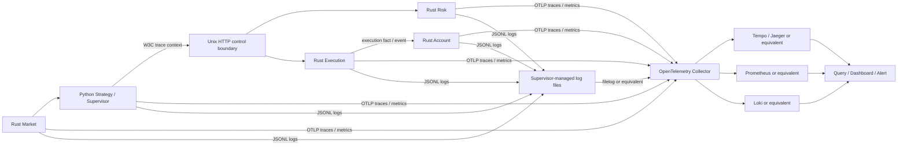

# Kairos 跨 Rust/Python 可观测性实施与验收

## 1. 文档目的

本文定义 Kairos 使用 `tracing + OpenTelemetry Collector` 补齐跨 Rust/Python
可观测性的实施路径、数据规范和整体验收标准。它既是当前改造的工作清单，也是判断
项目能否从“开发原型”进入“开发环境闭环”或“生产可用”的验收依据。

本文只处理可观测性职责，不改变业务状态所有权：

- Workspace/System 负责进程级 telemetry 配置、生命周期和部署资源；
- Application 负责业务用例和跨进程操作的 span 边界；
- Services 记录内部运行事件、指标和依赖调用；
- Domain 保持纯业务模型，不依赖 `tracing`、OpenTelemetry SDK 或 Collector；
- Collector 和后端不可成为业务状态、审计事实或恢复流程的唯一来源。

当前逐项证据和未完成门槛见
[`observability-acceptance-audit.md`](observability-acceptance-audit.md)。

## 2. 当前状态

截至 2026-08-10，本地 Docker 栈已完成 traces、metrics、logs 的接收和查询验证；在
CI 的 Docker smoke test 成功、性能/安全证据齐备且变更进入目标分支前，仍不能标记为
整体已落地。

| 能力 | 当前状态 | 说明 |
|---|---|---|
| Rust `tracing` 到 OTLP | 已实现并有测试 | 共享 layer、资源属性、batch exporter、shutdown 和控制面 span 已接通 |
| Python 到 Rust 上下文传播 | 已验证 | Unix HTTP `traceparent` 注入、Rust 提取和远端父 span 有端到端测试 |
| Collector 本地配置 | 已运行验证 | OTLP、filelog、Tempo、Prometheus、Loki、Grafana 与 health/limits/batch 已在 Docker 实际启动 |
| 生产 Collector 配置 | 已实现并校验 | production overlay 禁用 host port/匿名 Grafana；Collector 使用 mTLS intake、TLS backend export、有限重试、bounded queue、错误优先 tail sampling；真实证书与生产后端 rollout 仍待环境验收 |
| Rust/Python 日志关联 | 已实现 | 两种运行时输出 JSONL；活动 span 输出 `trace_id`/`span_id`，策略日志测试覆盖 key、secret、Authorization 及异常文本中的 credential 脱敏 |
| 全进程覆盖 | 已实现 | strategy、system supervisor、五个 Rust 业务服务与 Aeron driver 均有初始化/关闭路径 |
| 指标体系 | 基线已实现 | process readiness、strategy command、控制面 operation/失败/耗时/队列、market lag/gap/retry、execution reconnect/outbox pending/oldest age/checkpoint age 和 snapshot generation 已接通 |
| 可查询后端 | 已运行验证 | Tempo 查询到真实 span，Prometheus 查询到 OTLP metric，Loki 可按 trace ID 查询 JSONL 日志 |
| CI 验收 | 已编排待运行 | Python 安装 observability extra；跨语言传播、Collector startup/intake 及 Collector unavailable 降级测试均不再在 CI 跳过 |
| 正式交付 | 未完成 | 可观测性相关实现尚未形成独立、可审查、可重复验证的提交 |

更新本表时必须附带代码提交和验收证据，不能仅依据“代码文件已经存在”调整状态。

### 本地运行证据（2026-08-10）

在 macOS 开发机、Docker Desktop 已运行的前提下，以下命令已实际通过：

```text
docker compose -f deploy/observability/compose.yaml up -d --wait
KAIROS_RUN_COLLECTOR_SMOKE=1 KAIROS_LOG_ROOT=$PWD/.kairos/logs \
  uv run --extra observability pytest -q tests/test_collector_smoke.py
# 4 passed

KAIROS_RUST_OTEL_BIN=target/debug/kairos-risk-server \
KAIROS_RUN_RUST_OTEL_INTEGRATION=1 \
  uv run --extra observability pytest -q \
    tests/test_rust_otel_integration.py tests/test_rust_otel_unavailable.py
# 4 passed
```

其中 smoke test 向 Collector 写入真实 OTLP trace、metric 和 JSONL log，分别由 Tempo、
Prometheus 和 Loki 查询到；Grafana 已加载 Tempo、Prometheus、Loki 三个 datasource
以及 `Kairos Observability Overview` dashboard。Collector 重启后在 1 秒内恢复 health，
并再次通过四项 smoke test。跨语言测试使用验收 trace id
`0123456789abcdef0123456789abcdef`，验证 Python 注入的 W3C context 被 Rust Risk 服务
提取、关联到控制面 span 并导出。该证据只覆盖开发环境，不替代 CI、性能和生产安全验收。
Collector 不可用验收还覆盖拒绝连接、返回 HTTP 5xx 与慢响应三种 exporter 故障；每种情形下
Risk control service 均能继续响应 health/stop，且在 10 秒限制内正常退出。

性能基准脚本为 `scripts/benchmark_observability.py`。同日以 500 个顺序 Unix HTTP health
请求在本机 release binary 上复测，结果保存为
`docs/evidence/observability-performance-release-sampled-2026-08-10.json`：通过根 span
10% ParentBased 采样后，throughput 下降 0.92%、p95 未恶化，均符合第 8.6 节门槛；RSS 增长
22.64%，仍超过 10% 门槛。因此性能验收保持**未完成**，下一步需以长时间稳态采样证明 RSS
开销，或继续减少 telemetry provider 的常驻内存。旧 debug 结果保留用于说明优化前基线。

## 3. 目标架构



同步请求使用 W3C Trace Context 传播技术链路。异步业务事件使用稳定的
`event_id`、`correlation_id`、`causation_id` 和事件序列关联，不把持久化业务事件
的生命周期强行等同于同步 trace 生命周期。图中的跨业务箭头表示调用或事实传播，
不表示一个业务模块可以导入另一个模块的私有 `services` 实现；跨模块协作仍通过
Application、contract 和 composition 完成。

## 4. 配置契约

### 4.1 启用规则

Telemetry 默认关闭。满足以下任一条件时启用对应 signal：

- `KAIROS_OTEL_ENABLED=1`；
- 配置了 signal-specific OTLP endpoint；
- 配置了通用 OTLP endpoint。

关闭时必须满足：

- 不连接 Collector；
- 不改变业务请求结果；
- 不要求 Python 安装 observability extra 才能使用普通 CLI；
- 埋点调用保持低成本 no-op。

### 4.2 Endpoint 优先级

Traces：

```text
OTEL_EXPORTER_OTLP_TRACES_ENDPOINT
  > OTEL_EXPORTER_OTLP_ENDPOINT + /v1/traces
  > KAIROS_OTEL_ENABLED=1 时的 http://127.0.0.1:4318/v1/traces
```

Metrics：

```text
OTEL_EXPORTER_OTLP_METRICS_ENDPOINT
  > OTEL_EXPORTER_OTLP_ENDPOINT + /v1/metrics
  > KAIROS_OTEL_ENABLED=1 时的 http://127.0.0.1:4318/v1/metrics
```

Rust 和 Python 必须使用相同优先级。`OTEL_EXPORTER_OTLP_ENDPOINT` 表示 base URL，
不能在一端把它解释为完整 traces URL、另一端把它解释为 base URL。

### 4.3 根 span 采样

`KAIROS_OTEL_TRACE_SAMPLE_RATIO` 控制没有远端父上下文的根 span 采样率，取值为
`0.0` 至 `1.0`，默认 `0.1`。两种运行时都使用 ParentBased sampler：已采样的 W3C
远端父 trace 必须继续采样，因而跨 Python/Rust 的受控请求不会因本地比例采样而断链。
无效配置回退到默认值。生产 Collector 仍保留所有错误 trace，并对剩余 trace 执行二次
tail sampling。

### 4.4 Resource 属性

所有长生命周期进程至少提供：

```text
service.name
service.instance.id
deployment.environment
kairos.workspace_id
kairos.launch_id
kairos.launch_mode
kairos.component
```

进程应在解析参数、打开 workspace 后初始化 telemetry，以保证资源标识来自真实运行
上下文，而不是依赖调用方重复构造环境变量。

## 5. 实施路径

### 阶段一：收拢变更和稳定配置

1. 将可观测性文件和依赖变更整理成独立提交；
2. 统一 Rust/Python endpoint 解析；
3. 调整进程初始化和 shutdown 顺序；
4. 保证 `process_failed` 在 exporter shutdown 前记录；
5. 增加 enabled、disabled、generic endpoint、signal endpoint 配置测试。

完成标准：配置语义在两种运行时完全一致，Collector 不可用不影响业务进程启动。

### 阶段二：补齐进程覆盖和上下文传播

1. 为 strategy、system supervisor 等 Python 长生命周期入口安装 provider；
2. 为 Account、Execution、Market、Reference、Risk 等 Rust 服务统一初始化；
3. 为其他长生命周期 Rust 进程明确纳入或排除理由；
4. Python Unix HTTP client 注入 W3C context；
5. Rust Axum control endpoint 提取远端 context；
6. Rust `RestControlClient` 等出站请求注入当前 context；
7. 在业务用例入口创建根 span，在依赖边界创建 client/server span。

完成标准：一条真实业务链路包含至少一个 Python span 和两个 Rust span，并保持同一
`trace_id` 和正确父子关系。

### 阶段三：统一结构化日志

1. Rust/Python 使用统一字段和事件命名；
2. Python `StrategyLogger` 注入当前 `trace_id` 和 `span_id`；
3. Rust span 内事件输出当前 trace 上下文；
4. 错误日志增加稳定错误码、错误分类和 `retryable`；
5. 增加 secret、token、认证头脱敏测试；
6. 检查高频行情路径，默认不逐条输出 INFO。

完成标准：使用一个 `trace_id` 可以同时过滤出 Python 和 Rust 日志，并从日志定位到
对应 trace。

### 阶段四：补齐最小指标集

至少实现：

```text
process_start_total
process_ready
operation_total
operation_failed_total
operation_duration
queue_depth
queue_rejected_total
event_lag
event_gap_total
reconnect_total
retry_total
snapshot_generation
outbox_pending
outbox_oldest_age
checkpoint_age
```

指标名称、单位和 label 语义必须跨 Rust/Python 一致。Order ID、Request ID、Account
ID、Instrument ID 等高基数字段不得作为 metrics label；它们可以进入受控的 span
attribute 或脱敏日志字段。

完成标准：可以按 service、instance、environment 查看请求量、错误率、p50/p95/p99
延迟和关键 backlog/freshness 指标。

### 阶段五：接入后端和运维能力

1. traces 接入 Tempo、Jaeger 或等价后端；
2. metrics 接入 Prometheus 或等价后端；
3. logs 明确使用 Collector/filelog 到集中后端，或提供等价的集中查询方案；
4. Collector 启用 memory limiter、batch、bounded queue、retry 和 healthcheck；
5. 区分本地 compose 与生产 overlay；
6. 生产配置增加 TLS/Auth、采样、资源限制和保留周期；
7. 提供最小 dashboard 和告警规则。

`debug` exporter 只用于开发排查，不能作为生产落地证据。

### 阶段六：固化 CI 和交付证据

1. Python CI 安装 `observability` extra；
2. Rust CI 编译和测试 OTel feature；
3. 跨语言测试不再默认跳过；
4. CI 启动 Collector 执行 smoke test；
5. CI 验证 Collector 不可用时业务降级；
6. CI 检查日志字段、资源属性、endpoint 语义和敏感信息；
7. 文档记录启动、查询、排障、采样和关闭流程。

完成标准：新环境仅依据仓库和文档即可重复完成整套验收。

## 6. Trace 规范

### 6.1 Span 命名

使用稳定、低基数名称：

```text
strategy.signal
unix_http.request
risk.reserve
execution.submit_order
account.apply_fill
market.publish_snapshot
reference.refresh
```

不得把 order ID、request ID 或 symbol 拼入 span 名称，应将它们作为 attribute。

### 6.2 必要属性

控制和业务 span 至少包含适用的以下属性：

```text
component
operation
request_id
event_id
correlation_id
http.request.method
url.path
http.response.status_code
duration_ms
result
error.code
error.retryable
```

### 6.3 状态规则

- 参数校验失败和正常业务拒绝记录稳定结果，不一律视为系统错误；
- transport、timeout、dependency unavailable 等操作失败设置 error status；
- span 必须在操作完成后记录最终状态和耗时；
- exporter 错误不得进入业务控制流。

## 7. 日志规范

Rust/Python JSONL 公共必填字段：

```text
schema_version
system_time
level
event
component
process_id
instance_id
workspace_id
trace_id
span_id
request_id
duration_ms
result
```

错误日志额外包含：

```text
error_code
error_kind
retryable
operation
cause
```

业务事件存在时还应记录 `event_time`、`event_time_source`、`event_id`、
`event_sequence`、`correlation_id` 和 `causation_id`。不存在的字段可以为空，但字段
含义不能在不同运行时中变化。

## 8. 整体验收标准

### 8.1 代码和进程覆盖

- 可观测性改动已提交并进入目标分支；
- 仓库中不存在相关未跟踪实现；
- 所有长生命周期进程均有明确的初始化和 shutdown 行为；
- Domain 不依赖 telemetry SDK；
- Application API 不暴露 exporter、Collector 或 SDK 类型；
- telemetry disabled 模式可独立运行。

### 8.2 端到端链路

至少验收两条链路：

```text
Python supervisor/strategy -> Rust control service
strategy.signal/order -> Risk -> Execution -> Account/result
```

通过标准：

- 同一业务操作保持同一 `trace_id`；
- client/server span 父子关系正确；
- 至少包含一个 Python span 和两个 Rust span；
- method、path、status、duration 和结果完整；
- 失败链路包含稳定错误码；
- trace 在请求完成后 30 秒内可查询；
- 日志可以使用同一 `trace_id` 关联。

### 8.3 指标和告警

- 请求量、错误率和 p50/p95/p99 延迟可查询；
- process readiness、queue、lag、gap、retry、outbox 和 checkpoint 可查询；
- Collector/exporter 故障有告警；
- 业务服务不可用、错误率升高、队列积压和行情 freshness 恶化有最小告警；
- 指标不存在无界高基数 label。

### 8.4 Collector 和后端

- Collector 配置通过语法和组件校验；
- OTLP HTTP traces/metrics endpoint 可接收数据；
- traces、metrics 和 logs 具有明确可查询后端；
- Collector 有 healthcheck、资源限制、batch、bounded queue 和 retry；
- Collector 重启后 60 秒内恢复接收；
- 生产配置具备 TLS/Auth、采样和保留策略。

### 8.5 故障隔离

必须注入：

- Collector 未启动；
- Collector 超时；
- Collector 返回 5xx；
- Collector 运行中重启；
- exporter queue 满；
- 应用正常退出和异常退出。

通过标准：

- 业务结果不依赖 Collector；
- 应用不崩溃、不死锁、不无限重试；
- exporter 内存和队列有明确上限；
- 降级日志限频，不产生日志风暴；
- Collector 恢复后应用自动继续导出；
- 正常退出在约定时间内 flush；
- 最终失败事件在 shutdown 前记录。

### 8.6 性能

在相同数据、机器、配置和版本下对比 telemetry disabled/enabled：

- 吞吐下降不超过 5%；
- p95 延迟增加不超过 5%；
- 稳态 RSS 增长不超过 10%；
- 高频行情不为每个 tick 无条件创建重型 span；
- benchmark 保存输入、环境、采样策略和版本信息。

如现有模块已有更严格性能基线，以更严格标准为准。

### 8.7 安全

- API secret、私钥、完整 token、认证头不进入日志、span 和 metrics；
- 账户、订单和请求标识按场景脱敏；
- 生产 OTLP 链路使用 TLS/Auth；
- dashboard 和后端访问执行最小权限；
- 自动测试覆盖日志、exception、Debug 和 exporter attribute 脱敏。

## 9. CI 验收清单

CI 至少执行：

```text
uv sync --locked --group dev --extra observability
uv run ruff check kairospy tests
uv run ruff format --check kairospy tests
uv run pyright
uv run pytest -q
cargo fmt --all -- --check
cargo clippy --workspace --all-targets --all-features -- -D warnings
cargo test --workspace
git diff --check
Collector config validation
Collector startup smoke test
Python -> Rust OTLP end-to-end test
Collector unavailable degradation test
```

要求：

- 跨语言测试不能依赖人工设置变量才运行；
- 不能因缺少 OTel package 而 skip 后仍判定可观测性验收成功；
- CI 保存至少一个验收 `trace_id`、Collector 输出和测试报告；
- 与可观测性无关的既有失败必须单独报告，不能隐藏本次验收结果。

## 10. 验收证据包

每次宣称进入新状态时，应保存：

1. 对应 commit/PR；
2. CI 运行地址或完整本地命令结果；
3. 一条成功 trace 的 `trace_id` 和服务列表；
4. 一条失败 trace 的错误状态和日志关联结果；
5. 核心 dashboard 截图或导出定义；
6. Collector 故障注入结果；
7. enabled/disabled 性能对比；
8. 敏感字段扫描结果；
9. 当前配置和版本信息。

## 11. 状态判定

### 未落地

存在设计或局部代码，但没有可重复的跨语言运行证据。

### 开发环境闭环

满足以下全部条件：

- 核心 Python/Rust trace 传播通过；
- Rust/Python 日志可用 `trace_id` 关联；
- Collector 和本地查询后端可启动；
- 最小 metrics 可查询；
- Collector 故障不会影响业务；
- CI 强制执行端到端测试。

### 生产可用

在开发环境闭环基础上，还满足：

- 全部长生命周期进程覆盖；
- 生产后端、TLS/Auth、采样和保留策略完成；
- dashboard、告警和 runbook 完成；
- 故障注入、安全和性能验收全部通过；
- 具有持续运行和 Collector 重启恢复证据。

## 12. 一票否决项

出现以下任意一项，不能标记为整体已落地：

- OTel 相关实现尚未提交；
- 跨语言测试默认跳过；
- 只有 Collector `debug` exporter；
- Python 日志没有 `trace_id`/`span_id`；
- 只有控制面 span，没有真实业务根 span；
- 只覆盖一个 Rust 服务；
- Collector 故障影响业务正确性或进程存活；
- CI 没有安装 observability dependencies；
- 日志、span 或 metrics 泄露凭据；
- 文档、运行配置和代码行为不一致。

只有所有必选项通过并形成验收证据包后，才能把本项目状态更新为“生产可用”。
